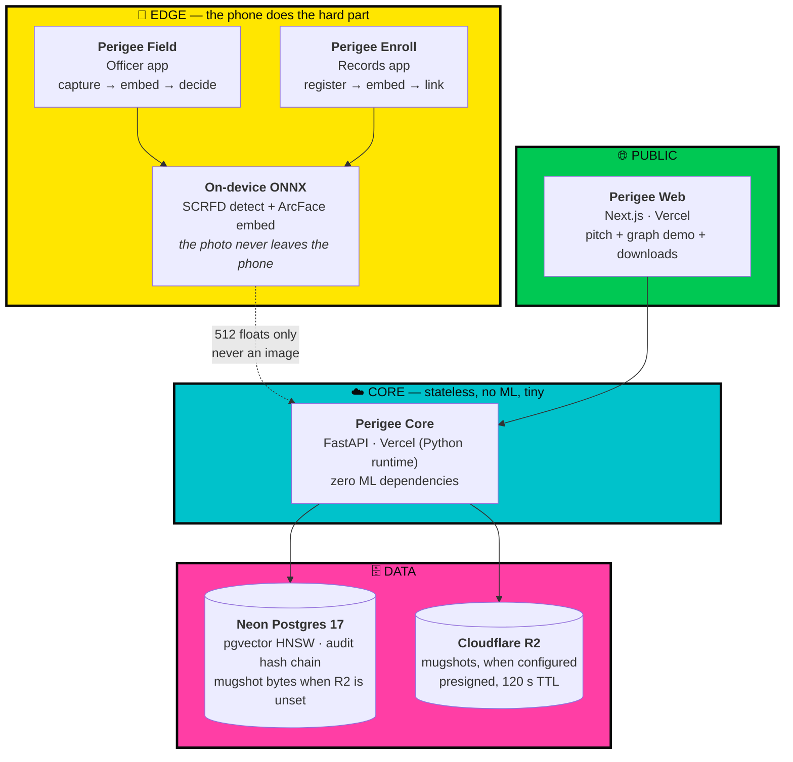

# PERIGEE

> **peri·gee** /ˈperəjē/ — *n.* the point in an orbit at which a body is closest to the Earth.
> The moment of closest approach. The instant the record meets the officer.

**Perigee is a field identity-screening system for law enforcement.** An officer photographs a
person of interest, the phone computes a face embedding **on-device**, and the system returns a
**ranked shortlist of candidates** from a criminal records database — in under a second, at the
roadside, without a trip to the station.

The officer decides. Always. The system never does.

---

## The problem

Today, when an officer has reasonable suspicion about a person, verifying identity and criminal
history means physically taking that person to the **thana**, filing a register entry, and manually
querying records. This costs hours — for the officer, and for a person who is very often innocent.

**Perigee collapses that loop to eight seconds.** Most people get to walk away immediately.
That is the point: this is as much a tool for *clearing* people as for identifying them.

---

## What's in this repository

| Path | Status |
| --- | --- |
| [`docs/`](docs/) | Architecture and specification — the contract everything is built against |
| [`backend/`](backend/) | **Perigee Core** — FastAPI + pgvector. Search, decisions, audit chain, graph. Deployed on Vercel. |
| [`mobile/`](mobile/) | **Perigee Field** + **Perigee Enroll** — Expo monorepo. On-device SCRFD + ArcFace face pipeline, camera, ONNX Runtime. |
| [`web/`](web/) | **Perigee Web** — Next.js marketing site and live graph demo, deployed on Vercel. |
| [`testing/testcamera/`](testing/testcamera/) | Expo camera proof-of-concept — VisionCamera 5, Android CameraX, local release builds |

> **Face recognition runs on-device today.** SCRFD detects the face, ArcFace (`w600k_r50`) produces
> the 512-d embedding, and both apps submit it through the same `embedding: number[512]` contract the
> backend has always taken. Models are pinned, SHA-256-verified, and mirrored from the official
> InsightFace v0.7 release. `DATASET_MODE=synthetic` still governs every record in the database —
> the *pipeline* is real, the *population* it searches is not.

| Document | What it covers |
| --- | --- |
| [00 — Executive Summary](docs/00-EXECUTIVE-SUMMARY.md) | The pitch, in one page. Read this first. |
| [01 — System Architecture](docs/01-ARCHITECTURE.md) | **The spine.** Components, boundaries, data flow, latency budget. |
| [02 — Data Model](docs/02-DATA-MODEL.md) | Full Postgres + pgvector DDL, audit hash chain, graph tables. |
| [03 — API Specification](docs/03-API-SPEC.md) | Every endpoint, request/response, error taxonomy. |
| [04 — Face Recognition Pipeline](docs/04-FACE-PIPELINE.md) | Models, alignment, thresholds, quality gates, bias governance. |
| [05 — Mobile Applications](docs/05-MOBILE-APPS.md) | Perigee Field + Perigee Enroll. Screens, state, navigation. |
| [06 — Web Frontend](docs/06-WEB-FRONTEND.md) | Next.js marketing site and live graph demo. |
| [07 — Design System](docs/07-DESIGN-SYSTEM.md) | Neobrutalist tokens, motion grammar, accessibility rules. |
| [08 — Security & Governance](docs/08-SECURITY.md) | Threat model. How we are defensible without login screens. |
| [09 — India Compliance Annex](docs/09-COMPLIANCE-INDIA.md) | DPDP Act 2023, FRT Bill, Puttaswamy, BNS/IPC, CCTNS path. |
| [10 — Deployment Runbook](docs/10-DEPLOYMENT.md) | The complete $0/month hosting plan, step by step. |
| [11 — Graph Intelligence](docs/11-GRAPH-INTELLIGENCE.md) | Criminal network graph: edges, traversal, orbital visualisation. |
| [12 — Scaling & Roadmap](docs/12-SCALING-ROADMAP.md) | What breaks at 10⁵, 10⁶, 10⁷ faces — and what replaces it. |
| [13 — Build Plan](docs/13-BUILD-PLAN.md) | Hackathon execution order with a critical path and cut-lines. |
| [ADR/](docs/ADR/) | Architecture Decision Records — the *why* behind each fork. |
| [Contract Notes](docs/CONTRACT-NOTES.md) | Where the implementation resolves an ambiguity or departs from the spec, and why. |

---

## Architecture at a glance

**The load-bearing idea:** face inference runs on the phone. The server receives a 512-float
vector and never sees a face. That one decision gives us the privacy story, a backend that fits in
a free 512 MB instance with no ML dependencies at all, and an app that works on a patchy rural
connection.

---

## Stack

| Layer | Choice | Why |
| --- | --- | --- |
| Mobile | Expo SDK 54+ · React Native 0.81+ · New Architecture | One monorepo, two app targets, OTA updates |
| On-device ML | ONNX Runtime React Native · SCRFD + ArcFace | 512-d embeddings computed locally |
| Motion | Reanimated 4 · Moti · Gesture Handler · Skia | The GSAP-equivalent stack for RN |
| Backend | Python 3.13 · FastAPI · Pydantic v2 · asyncpg | Native runtime, no Docker, zero ML deps |
| Database | Neon Postgres 17 + pgvector 0.8 (HNSW / halfvec) | Vectors, relations, and graph in one transaction |
| Object store | Cloudflare R2, optional — Postgres `bytea` fallback | Mugshots work with zero external accounts to provision |
| Web | Next.js 16 App Router · Tailwind v4 | Vercel Hobby, ISR, edge-fast |
| Design | Neobrutalism × cyberpunk, shared token package | High contrast is an *operational* advantage in daylight |
| Hosting | Vercel (API + web) + Neon + EAS | **₹0 / $0 per month** |

---

## Non-negotiable design rules

These are structural, not stylistic. Every one of them is enforced in the schema or the API — not
by convention or by a UI reminder.

1. **The API never returns a match.** It returns ranked *candidates* with similarity scores. There is
   no `is_match` boolean anywhere in the system, because there is no question the machine is
   permitted to answer.
2. **A search is incomplete until a human adjudicates it.** `search_event` opens in
   `PENDING_DECISION`. Accumulate too many undecided searches and the device is rate-limited into
   a stop. You cannot spray-and-pray.
3. **Always show at least three candidates**, even when the top score is overwhelming. Forced
   comparison is the cheapest known countermeasure to automation bias.
4. **The vector table holds no names.** Compromise it alone and you have recovered a pile of floats.
5. **Every embedding carries its `model_id`,** and search filters on it. Vectors from different
   models are not comparable, and silently mixing them is the single most common way these systems
   quietly start lying.
6. **The audit log is append-only and hash-chained.** `sha256(prev_hash ‖ row)`. Rewriting history
   is detectable.
7. **Probe images are never persisted.** Not the photograph of the person stopped by the roadside.
   Only the embedding, the score, and the decision.
8. **`DATASET_MODE=synthetic` is a hard flag.** Every response carries it and both apps render a
   permanent watermark. Nobody mistakes the prototype for a live system.

Rationale for each in [08 — Security & Governance](docs/08-SECURITY.md).

---

## Scope of this prototype

**In scope:** two mobile apps, one API, one database, one marketing site, entirely synthetic data,
no authentication, single-jurisdiction, Android distribution.

**Explicitly out of scope,** with upgrade paths documented in
[12 — Scaling & Roadmap](docs/12-SCALING-ROADMAP.md): officer authentication and RBAC, live CCTNS/ICJS
integration, iOS public distribution, video/CCTV ingestion, presentation-attack (liveness) detection,
and multi-state federation.

> ⚠️ **This system operates exclusively on synthetic data.** No real biometric record of any
> person has been, or will be, processed by this prototype. Deploying it against real records
> requires the legal authorisation, DPIA, and oversight described in
> [09 — India Compliance Annex](docs/09-COMPLIANCE-INDIA.md) — a bar this prototype does not
> pretend to clear.

---

## Related work

Perigee is designed as the **field-capture arm** of a two-part system. Its sibling,
[KAVAL](https://github.com/SarmaHighOnCode/KSPDatathon) (KSP Datathon 2026), is the
**analysis brain** — natural-language querying over crime records. They deliberately share a
canonical schema (`dim_person`, `grf_edges`, `audit_events`), so records enrolled through Perigee
are directly queryable in KAVAL. See [01 — System Architecture § 9](docs/01-ARCHITECTURE.md).

---

## License

TBD before public release. Recommend AGPL-3.0 — a system with this capability profile should not be
forkable into a closed product without the source travelling with it.
