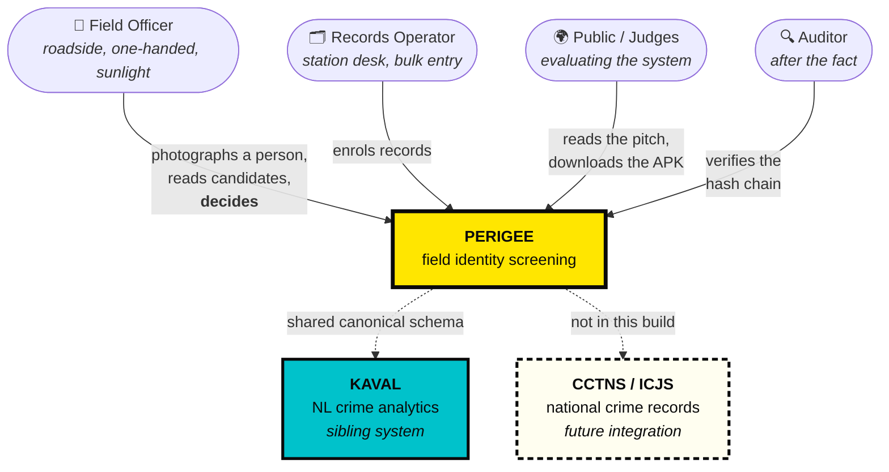
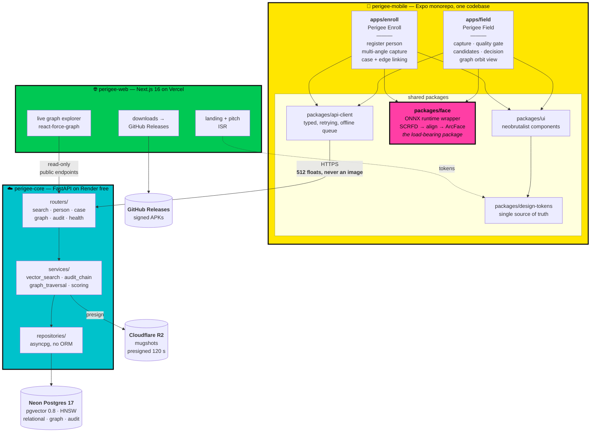
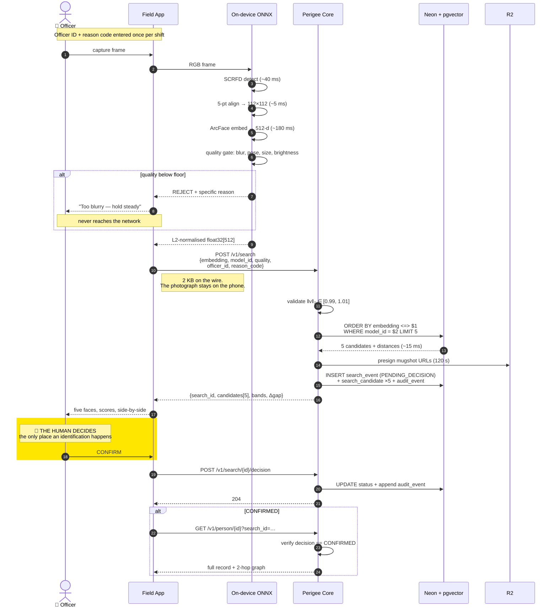
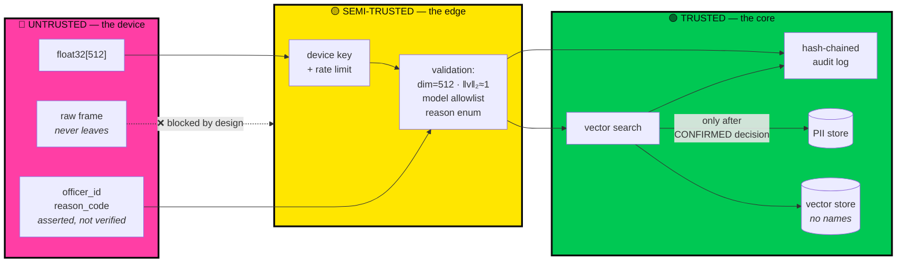

# 01 — System Architecture

The spine document. Component boundaries, data flow, failure modes, latency budget.

---

## 1. Design constraints

Everything below is downstream of these. They were fixed before any technology was chosen.

| # | Constraint | Source | Consequence |
| --- | --- | --- | --- |
| C1 | Total infrastructure cost must be ₹0 | Hackathon | No GPU, no always-on ML server, ≤512 MB RAM backend |
| C2 | No authentication | Explicit requirement | Security must come from layers that cost no UX |
| C3 | Must survive a live demo on venue Wi-Fi | Hard-won experience | Offline-tolerant capture, aggressive pre-warming |
| C4 | Government-adoptable | Product goal | Audit, purpose-binding, compliance annex are load-bearing |
| C5 | Synthetic data only | Ethics + law | Hard flag, watermark, no path to real data in this build |
| C6 | Backend on Render, native Python, no Docker | Explicit requirement | Backend cannot carry heavy ML dependencies |
| C7 | Two mobile apps + one website | Explicit requirement | Monorepo with shared packages, not three codebases |

**C1 and C6 together are the forcing function.** A 512 MB native-Python Render instance cannot host
ArcFace. That is not a limitation we worked around — it is the constraint that produced the best
property of the design.

---

## 2. Context (C4 Level 1)



---

## 3. Containers (C4 Level 2)



### Why one mobile monorepo and not two projects

The two apps share the camera stack, the entire ONNX pipeline, the design system, the API client
and the offline queue. That is roughly 80% of the code. Two separate repositories means maintaining
that twice, and during a hackathon it means fixing every bug twice.

```
perigee-mobile/
├── apps/
│   ├── field/          # com.perigee.field   — officer app
│   └── enroll/         # com.perigee.enroll  — records app
├── packages/
│   ├── face/           # ONNX: detect → align → embed → quality
│   ├── ui/             # Button, Card, ScoreBadge, CandidateTile…
│   ├── design-tokens/  # colors, spacing, motion — consumed by web too
│   └── api-client/     # generated from OpenAPI, offline queue
└── pnpm-workspace.yaml
```

Two `app.json`s, two bundle identifiers, two EAS build profiles, one dependency tree.

---

## 4. The identification flow

This is the sequence that matters. Note where the human sits and note what crosses the network.



**The three properties to notice:**

1. A rejected capture never reaches the network. Quality control happens where the camera is.
2. Between `POST /v1/search` and `POST …/decision` the system is *blocked on a human*. That gap is
   the product.
3. `GET /v1/person/{id}` requires a `search_id` with a recorded `CONFIRMED` decision. The app cannot
   be used as a general-purpose PII browser. This is **purpose-binding enforced in the API**, not in
   the UI.

---

## 5. Latency budget

Measured targets on a mid-range Android device (Snapdragon 6-series class, 6 GB RAM) over 4G.

| Stage | Where | p50 | p95 | Notes |
| --- | --- | --- | --- | --- |
| Camera frame → RGB buffer | device | 15 ms | 30 ms | `expo-camera` `takePictureAsync`, downscaled |
| SCRFD face detection | device | 40 ms | 90 ms | 640×640 input, NNAPI/CoreML EP when available |
| Landmark align → 112×112 | device | 5 ms | 10 ms | similarity transform, 5 points |
| **ArcFace embedding** | device | **180 ms** | **380 ms** | dominant cost; XNNPACK, 4 threads |
| Quality gate | device | 5 ms | 8 ms | Laplacian variance + pose from landmarks |
| Network round trip | 4G | 120 ms | 400 ms | 2 KB request, ~8 KB response |
| pgvector HNSW search | Neon | 15 ms | 40 ms | at 10⁴ vectors; scale table in doc 12 |
| Presign 5 R2 URLs | Render | 8 ms | 20 ms | HMAC only, no network call to R2 |
| Audit write | Neon | 12 ms | 35 ms | single transaction with the event insert |
| Render candidate list | device | 30 ms | 60 ms | Reanimated staggered entry |
| **Total** | | **~390 ms** | **~890 ms** | |

**Budget rule: p95 under 1 second or the interaction feels broken.** If ArcFace on the target device
exceeds 400 ms, the fallback ladder in [04 — Face Pipeline](04-FACE-PIPELINE.md) §7 applies.

**Excluded from this budget:** Render free-tier cold start (~50 s after 15 min idle). Mitigated by
pre-warming on app launch and a keepalive during demo windows — see
[10 — Deployment](10-DEPLOYMENT.md) §5.

---

## 6. Why the model runs on the phone

This was the primary architectural fork. Recorded in full as [ADR-0001](ADR/0001-on-device-embedding.md).

| | On-device (chosen) | Server-side |
| --- | --- | --- |
| Raw biometric on the network | **Never** | Every search |
| Backend RAM needed | ~120 MB | ~700 MB — **exceeds Render free** |
| Backend ML dependencies | **Zero** | onnxruntime, numpy, opencv |
| Works on weak connectivity | 2 KB up | 200 KB up per attempt |
| Model version control | Harder — devices drift | Trivial |
| Cost at 1000 searches/day | ₹0 | GPU or a very slow CPU queue |
| DPDP data-minimisation posture | Strong | Weak |

The model-drift problem is the real cost of this choice, and it is handled explicitly: every
embedding row carries `model_id`, search filters on it, and the server refuses vectors from an
unknown model with `422`. See §7.

**The contract is embedding-first, not device-first.** `POST /v1/search` accepts a vector. Where that
vector was computed is not the API's concern. A server-side `/v1/embed` endpoint is specified and
remains **disabled on Render** (`ENABLE_SERVER_EMBED=false`) purely because 512 MB cannot hold the
model — it switches on unchanged if the backend moves to a host with more memory. Neither path is
special-cased downstream.

---

## 7. Model versioning — the failure mode nobody plans for

Embeddings from two different models occupy **different, incomparable vector spaces**. Comparing an
ArcFace `w600k_r50` vector to a `w600k_mbf` vector produces a number. That number is meaningless.
It is also plausible-looking, which is what makes it dangerous: the system does not crash, it
quietly starts returning wrong people.

Enforcement, at three layers:

1. **Schema** — `face_embedding.model_id TEXT NOT NULL`, part of the natural key.
2. **Query** — every vector search carries `WHERE model_id = $2`. Non-negotiable; there is no code
   path that omits it. A partial HNSW index exists per active model.
3. **API** — `model_id` is a required request field, validated against a server-side allowlist.
   Unknown model → `422 UNSUPPORTED_MODEL`, never a silent search.

**Model migration** (when a better model ships) is additive, never in-place:

```
1. Add the new model_id to the allowlist, accepting=false
2. Backfill: re-embed every enrolled face under the new model → new rows, old rows untouched
3. Build the partial HNSW index for the new model_id
4. Ship the app update; new clients send the new model_id
5. Flip accepting=true for the new model; old clients keep working on old rows
6. After the old app version drops below threshold, drop the old index, then the old rows
```

Two model generations coexist in the same table throughout. There is no cutover moment.

---

## 8. Data flow and trust boundaries



**PII and vectors are separated stores.** `face_embedding` holds `person_id`, a vector, and a
`model_id` — no name, no address, no case. An attacker who exfiltrates the vector table alone has
floats and opaque UUIDs. Joining to identity requires the `person` table, which is separately
scoped. See [02 — Data Model](02-DATA-MODEL.md) §3.

**`officer_id` is attribution, not authentication.** With C2 (no auth) we cannot *prove* who is
searching. We can make every search permanently attributable to a claimed identity, displayed back
to the officer in the UI as `SEARCHING AS OFFICER-1147`, and recorded immutably. The honest framing
of what that does and does not buy is in [08 — Security](08-SECURITY.md) §2.

---

## 9. Relationship to KAVAL

[KAVAL](https://github.com/SarmaHighOnCode/KSPDatathon) is a natural-language query interface over
Karnataka State Police crime records. Perigee and KAVAL are designed as two halves of one system.

| | Perigee | KAVAL |
| --- | --- | --- |
| Role | **The hand** — field capture and identification | **The head** — analysis and interrogation |
| Where | Roadside, on a phone | Station, on a desktop |
| Input | A face | A question in Kannada or English |
| Output | Ranked candidates + a decision | Widgets, maps, network graphs |

**Deliberately shared:**

- `person` ↔ `dim_person` — same identity spine, same `masked_pii` convention
- `edge` ↔ `grf_edges` — identical `(src, dst, edge_type, weight, evidence_ids[])` shape
- `node_metric` ↔ `grf_node_metrics` — degree, betweenness, Louvain `community_id` via networkx
- `audit_event` ↔ `audit_events` — the same `sha256(prev_hash ‖ row)` chain construction
- IPC ↔ BNS dual citation on every offence reference

A person enrolled through Perigee Enroll in the field is queryable in KAVAL that evening without a
transformation step. This is the strongest argument for adoption: not a point tool, but a coherent
two-surface platform sharing one record spine.

---

## 10. Failure modes

| Failure | Detection | Behaviour | Recovery |
| --- | --- | --- | --- |
| Render cold start (~50 s) | app pre-warms `/healthz` on launch | "SYSTEM WAKING" state with a progress bar, not a spinner | keepalive cron during demo windows |
| Neon scale-to-zero (~500 ms) | first query latency | absorbed; invisible | connection pool retry, 1 attempt |
| No connectivity | `NetInfo` + request timeout | capture and embed still work; search queues locally | offline queue drains on reconnect, decisions still required |
| ONNX session fails to init | try/catch at app start | app blocks with a diagnostic screen and device details | server `/v1/embed` if enabled; otherwise the build is bad — fail loudly |
| Model too slow (>800 ms) | timed on first inference | drop to a smaller detector input (640→320) | logged to Sentry with the device fingerprint |
| Quality gate rejects repeatedly | 3 consecutive rejections | coaching overlay: "move to shade", "step closer" | manual override records `quality_override=true` in the audit log |
| Two candidates within Δ 0.05 | server computes the gap | `AMBIGUOUS` banner, both highlighted, confirm requires a second tap | forces the officer to look, rather than accept |
| Vector table and PII table disagree | FK constraint | `500`, never a partial record | transactional enrolment |
| Audit chain broken | `/v1/audit/verify` | returns the first bad `seq` | investigate; the chain is the evidence |

**The failure we design hardest against is not a crash — it is a plausible wrong answer.** Every
mitigation above that seems excessive exists because a confident false positive here costs a person
their afternoon, or worse.

---

## 11. Repository layout

Three repositories under one GitHub organisation, or one monorepo with three workspaces. For a
hackathon, **three repositories** — independent deploy triggers, no CI cross-talk.

```
perigee-core/            # FastAPI · deploys to Render on push to main
├── app/
│   ├── main.py
│   ├── config.py            # pydantic-settings, fails fast on missing env
│   ├── db.py                # asyncpg pool
│   ├── deps.py              # device key, rate limit, request context
│   ├── routers/             # search, person, case, graph, audit, health
│   ├── services/            # vector_search, audit_chain, scoring, graph
│   ├── repositories/        # raw SQL, no ORM
│   └── models/              # pydantic v2 request/response
├── migrations/              # numbered .sql, applied by a startup guard
├── scripts/                 # seed_synthetic.py, compute_node_metrics.py
├── tests/
├── render.yaml
└── requirements.txt

perigee-mobile/          # Expo monorepo · EAS Build
└── (see §3)

perigee-web/             # Next.js 16 · deploys to Vercel
├── app/
├── components/
└── lib/
```

---

## 12. Decision log

| ADR | Decision | Status |
| --- | --- | --- |
| [0001](ADR/0001-on-device-embedding.md) | Face embedding runs on-device; the API contract is embedding-first | Accepted |
| [0002](ADR/0002-postgres-for-everything.md) | One Postgres for relational, vector and graph — no separate graph DB | Accepted |
| [0003](ADR/0003-no-auth-defensible.md) | No authentication; defensibility from attribution, purpose-binding and audit | Accepted |
| [0004](ADR/0004-render-native-python.md) | Render free tier, native Python runtime, no Docker | Accepted |
| [0005](ADR/0005-neobrutalism-as-ergonomics.md) | Neobrutalist design as a field-ergonomics decision, not a stylistic one | Accepted |

---

**Next:** [02 — Data Model](02-DATA-MODEL.md)
