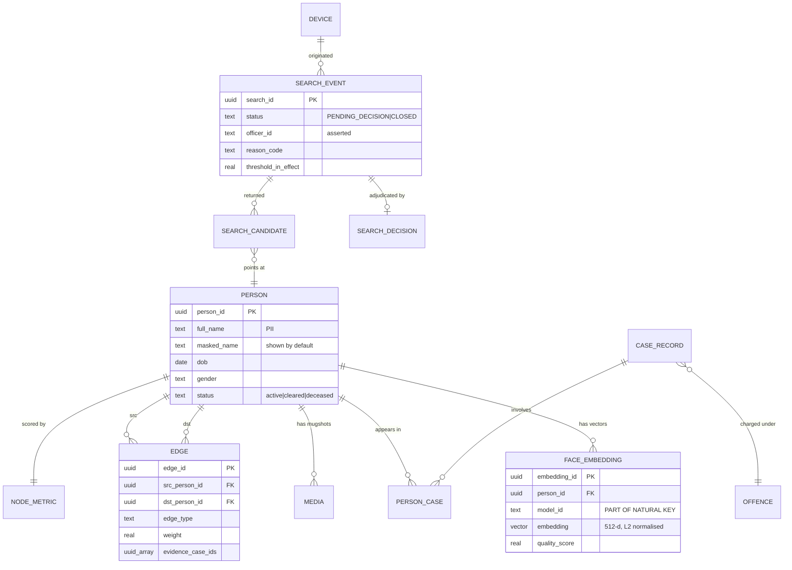

# 02 — Data Model

Postgres 17 on Neon, with `pgvector` ≥ 0.8. One database holds relational records, vector
embeddings, the graph, and the audit chain — inside a single transaction boundary.
Rationale: [ADR-0002](ADR/0002-postgres-for-everything.md).

---

## 1. Overview



Four groups, each with a different lifecycle:

| Group | Tables | Lifecycle |
| --- | --- | --- |
| **Identity** | `person`, `media`, `face_embedding` | written by Enroll, read by Field |
| **Records** | `case_record`, `offence`, `person_case`, `map_ipc_bns` | written by Enroll |
| **Graph** | `edge`, `node_metric` | derived; recomputed by a batch job |
| **Operational** | `search_event`, `search_candidate`, `search_decision`, `device`, `audit_event` | append-heavy, written by Field |

---

## 2. Extensions and conventions

```sql
CREATE EXTENSION IF NOT EXISTS vector;      -- pgvector >= 0.8
CREATE EXTENSION IF NOT EXISTS pgcrypto;    -- gen_random_uuid(), digest()

-- Conventions used throughout:
--   * UUIDv4 primary keys       — safe to generate client-side, no enumeration
--   * timestamptz, always UTC   — never a naive timestamp
--   * text + CHECK, not enum    — enums need a migration to extend; CHECK does not
--   * snake_case everywhere
--   * every table has created_at; mutable tables also have updated_at
```

**On `text` + `CHECK` over native `ENUM`:** adding a value to a Postgres enum requires
`ALTER TYPE`, which historically could not run inside a transaction alongside other DDL and is
awkward on managed platforms. A `CHECK` constraint is a one-line migration. At this scale the
storage difference is irrelevant.

---

## 3. Identity

### 3.1 `person`

```sql
CREATE TABLE person (
    person_id       uuid PRIMARY KEY DEFAULT gen_random_uuid(),

    -- PII. Never returned unless a CONFIRMED decision authorises it.
    full_name       text NOT NULL,
    aliases         text[] NOT NULL DEFAULT '{}',
    dob             date,
    gender          text CHECK (gender IN ('M','F','O','U')),
    address_line    text,
    phone           text,

    -- Always safe to return. Rendered in candidate lists before confirmation.
    masked_name     text NOT NULL,          -- 'R***** K****'
    age_band        text CHECK (age_band IN ('18-25','26-35','36-45','46-60','60+','UNKNOWN')),
    district        text,

    status          text NOT NULL DEFAULT 'active'
                    CHECK (status IN ('active','cleared','deceased','expunged')),

    -- Non-negotiable provenance flag. Enforced by config at write time.
    dataset_mode    text NOT NULL DEFAULT 'synthetic'
                    CHECK (dataset_mode IN ('synthetic','real')),

    created_at      timestamptz NOT NULL DEFAULT now(),
    updated_at      timestamptz NOT NULL DEFAULT now()
);

CREATE INDEX idx_person_district ON person (district) WHERE status = 'active';
CREATE INDEX idx_person_status   ON person (status);
```

`masked_name` and `age_band` exist so a candidate list can be rendered **without disclosing
identity**. The officer compares *faces*, and only the confirmed record unmasks. This matters: if
five full names appear on screen, four innocent people have been disclosed to an officer who had no
basis to see them.

`expunged` is a status, not a delete. Erasure is handled in §9.

### 3.2 `media`

```sql
CREATE TABLE media (
    media_id        uuid PRIMARY KEY DEFAULT gen_random_uuid(),
    person_id       uuid NOT NULL REFERENCES person(person_id) ON DELETE CASCADE,

    r2_key          text NOT NULL UNIQUE,   -- 'mugshots/{person_id}/{media_id}.jpg'
    sha256          bytea NOT NULL,         -- integrity + dedupe
    width           int  NOT NULL,
    height          int  NOT NULL,
    bytes           int  NOT NULL,

    capture_angle   text NOT NULL DEFAULT 'frontal'
                    CHECK (capture_angle IN ('frontal','left','right','up','down')),
    is_primary      boolean NOT NULL DEFAULT false,
    exif_stripped   boolean NOT NULL DEFAULT true,

    created_at      timestamptz NOT NULL DEFAULT now()
);

CREATE UNIQUE INDEX idx_media_one_primary
    ON media (person_id) WHERE is_primary;
```

**EXIF is stripped client-side before upload, always.** Mugshot EXIF carries GPS coordinates and a
device serial; neither belongs in a criminal record. `exif_stripped` is asserted by the client and
re-verified server-side on upload.

Bucket is private. Access is exclusively via presigned GET, TTL 120 s.

### 3.3 `face_embedding` — the core table

```sql
CREATE TABLE face_embedding (
    embedding_id    uuid PRIMARY KEY DEFAULT gen_random_uuid(),
    person_id       uuid NOT NULL REFERENCES person(person_id) ON DELETE CASCADE,
    media_id        uuid REFERENCES media(media_id) ON DELETE SET NULL,

    -- Vectors from different models are NOT comparable. See doc 01 §7.
    model_id        text NOT NULL,          -- 'insightface/w600k_r50@1'
    embedding       vector(512) NOT NULL,   -- L2-normalised, ‖v‖₂ = 1

    quality_score   real NOT NULL CHECK (quality_score BETWEEN 0 AND 1),
    det_score       real,                   -- detector confidence
    yaw             real,                   -- degrees, from 5-point landmarks
    pitch           real,

    created_at      timestamptz NOT NULL DEFAULT now(),

    -- One embedding per person, per model, per source image.
    UNIQUE (person_id, model_id, media_id)
);
```

**Deliberately absent: name, case, address.** Exfiltrating this table alone yields floats and
opaque UUIDs. Re-identification requires a second, separately-scoped table.

#### Indexing

```sql
-- Partial HNSW per active model. The WHERE clause is what makes model isolation
-- free rather than a filter applied after the index scan.
--
-- Indexed on halfvec: half the index memory, negligible recall loss, while
-- `embedding` itself stays full float32 as the source of truth.
CREATE INDEX idx_fe_hnsw_w600k_r50
    ON face_embedding
    USING hnsw ((embedding::halfvec(512)) halfvec_cosine_ops)
    WITH (m = 16, ef_construction = 64)
    WHERE model_id = 'insightface/w600k_r50@1';

CREATE INDEX idx_fe_person ON face_embedding (person_id);
CREATE INDEX idx_fe_model  ON face_embedding (model_id);
```

> **The query expression must match the index expression exactly**, or Postgres silently falls back
> to a sequential scan. Cast on both sides:
>
> ```sql
> SELECT person_id, embedding <=> $1::vector(512) AS distance
> FROM   face_embedding
> WHERE  model_id = $2
> ORDER  BY embedding::halfvec(512) <=> $1::halfvec(512)
> LIMIT  $3;
> ```
>
> Note the ordering key is `halfvec` (uses the index) while the returned distance is computed at
> full `vector` precision. Approximate ranking, exact reported score.
>
> Verify with `EXPLAIN (ANALYZE, BUFFERS)` that you see `Index Scan using idx_fe_hnsw_…`.
> If you see `Seq Scan`, the casts do not match. This is the single most common pgvector mistake.

**Parameters:** `m = 16` and `ef_construction = 64` are pgvector defaults and correct here.
`hnsw.ef_search` defaults to 40; raise it per-query for recall, never globally:

```sql
BEGIN;
  SET LOCAL hnsw.ef_search = 100;   -- LOCAL: dies with the transaction
  SELECT ...;
COMMIT;
```

At hackathon scale (< 10⁴ vectors) a sequential scan is genuinely fast enough. The index is built
anyway because the demo should reflect the production shape, and because building it after the fact
requires `maintenance_work_mem` that the free tier does not comfortably have.

---

## 4. Records

```sql
CREATE TABLE offence (
    offence_id      uuid PRIMARY KEY DEFAULT gen_random_uuid(),
    ipc_section     text,                  -- 'IPC 379'  (pre-2024)
    bns_section     text,                  -- 'BNS 303(2)' (from 2024)
    title           text NOT NULL,
    category        text NOT NULL,         -- 'property','violent','cyber','narcotics',…
    severity        text NOT NULL CHECK (severity IN ('petty','moderate','serious','heinous')),
    CHECK (ipc_section IS NOT NULL OR bns_section IS NOT NULL)
);

CREATE TABLE case_record (
    case_id         uuid PRIMARY KEY DEFAULT gen_random_uuid(),
    fir_number      text NOT NULL,
    station         text NOT NULL,
    district        text NOT NULL,
    offence_id      uuid REFERENCES offence(offence_id),

    registered_on   date NOT NULL,
    status          text NOT NULL DEFAULT 'open'
                    CHECK (status IN ('open','chargesheeted','convicted','acquitted','closed')),
    mo_text         text,                  -- modus operandi, free text
    summary         text,

    dataset_mode    text NOT NULL DEFAULT 'synthetic',
    created_at      timestamptz NOT NULL DEFAULT now(),
    UNIQUE (station, fir_number)
);

CREATE TABLE person_case (
    person_id       uuid NOT NULL REFERENCES person(person_id)      ON DELETE CASCADE,
    case_id         uuid NOT NULL REFERENCES case_record(case_id)   ON DELETE CASCADE,
    role            text NOT NULL CHECK (role IN
                        ('accused','convicted','suspect','victim','witness','complainant')),
    created_at      timestamptz NOT NULL DEFAULT now(),
    PRIMARY KEY (person_id, case_id, role)
);

CREATE INDEX idx_pc_case   ON person_case (case_id);
CREATE INDEX idx_pc_person ON person_case (person_id);
```

**IPC ↔ BNS dual citation.** The Bharatiya Nyaya Sanhita replaced the Indian Penal Code in July
2024, and every serving officer currently works across both. Records predating the transition carry
IPC sections; new ones carry BNS. Storing both columns and rendering `IPC 379 / BNS 303(2)`
everywhere removes a real, daily source of friction — and mirrors KAVAL's `map_ipc_bns` bridge, so
the two systems agree.

**`role` distinguishes `accused` from `convicted`.** Conflating them is how a prototype turns into
an accusation engine. The Field app renders them in different colours and never sums them into a
single "record count".

---

## 5. Graph

Schema deliberately identical to KAVAL's `grf_edges` / `grf_node_metrics`.

```sql
CREATE TABLE edge (
    edge_id         uuid PRIMARY KEY DEFAULT gen_random_uuid(),
    src_person_id   uuid NOT NULL REFERENCES person(person_id) ON DELETE CASCADE,
    dst_person_id   uuid NOT NULL REFERENCES person(person_id) ON DELETE CASCADE,

    edge_type       text NOT NULL CHECK (edge_type IN
                        ('co_accused','shared_address','shared_phone',
                         'same_mo','family','known_associate')),
    weight          real NOT NULL CHECK (weight BETWEEN 0 AND 1),

    evidence_case_ids uuid[] NOT NULL DEFAULT '{}',   -- WHY this edge exists
    first_seen      date,
    last_seen       date,
    computed_at     timestamptz NOT NULL DEFAULT now(),

    -- Undirected, stored once. Canonical ordering prevents (A,B) and (B,A) duplicates.
    CHECK (src_person_id < dst_person_id),
    UNIQUE (src_person_id, dst_person_id, edge_type)
);

CREATE INDEX idx_edge_src ON edge (src_person_id, weight DESC);
CREATE INDEX idx_edge_dst ON edge (dst_person_id, weight DESC);

CREATE TABLE node_metric (
    person_id       uuid PRIMARY KEY REFERENCES person(person_id) ON DELETE CASCADE,
    degree          int  NOT NULL DEFAULT 0,
    betweenness     real NOT NULL DEFAULT 0,
    community_id    int,                   -- Louvain partition
    computed_at     timestamptz NOT NULL DEFAULT now()
);
```

**`CHECK (src < dst)` with a UUID comparison** enforces canonical ordering, so an undirected edge
has exactly one row and `UNIQUE` actually prevents duplicates. Both directional indexes exist
because traversal queries hit either column.

**`evidence_case_ids` is the point.** An edge asserting two people are connected without a citable
case file is an unfalsifiable accusation. Every edge in the UI is clickable through to the FIRs
that produced it.

`node_metric` is recomputed offline by `scripts/compute_node_metrics.py` using networkx —
betweenness is O(V·E) and does not belong in a request path. Traversal itself is a recursive CTE,
detailed in [11 — Graph Intelligence](11-GRAPH-INTELLIGENCE.md).

---

## 6. Operational

### 6.1 `device`

```sql
CREATE TABLE device (
    device_id       uuid PRIMARY KEY DEFAULT gen_random_uuid(),
    key_hash        bytea NOT NULL UNIQUE,  -- sha256 of the device key; never the key itself
    label           text NOT NULL,          -- 'FIELD-DEMO-01'
    app             text NOT NULL CHECK (app IN ('field','enroll')),
    revoked         boolean NOT NULL DEFAULT false,
    last_seen_at    timestamptz,
    created_at      timestamptz NOT NULL DEFAULT now()
);
```

Only the hash is stored. A database dump does not yield working keys.

### 6.2 `search_event`

```sql
CREATE TABLE search_event (
    search_id       uuid PRIMARY KEY DEFAULT gen_random_uuid(),
    device_id       uuid REFERENCES device(device_id),

    -- Attribution, NOT authentication. Asserted by the client. See doc 08 §2.
    officer_id      text NOT NULL,
    reason_code     text NOT NULL CHECK (reason_code IN
                        ('routine_check','suspicious_conduct','warrant_service',
                         'missing_person','post_incident','training','browse')),

    model_id        text NOT NULL,
    probe_quality   real NOT NULL,
    -- Probe embedding retained ONLY for audit replay; toggled by config, default off.
    probe_embedding vector(512),
    -- The probe PHOTOGRAPH is never stored. Not configurable.

    geo_lat         double precision,
    geo_lon         double precision,

    -- Frozen so a decision can be re-audited against the policy of the day.
    threshold_in_effect  real NOT NULL,
    band_config     jsonb NOT NULL,

    top_score       real,
    score_gap       real,                  -- #1 minus #2; low gap ⇒ ambiguous
    candidate_count int NOT NULL DEFAULT 0,

    status          text NOT NULL DEFAULT 'PENDING_DECISION'
                    CHECK (status IN ('PENDING_DECISION','CLOSED','EXPIRED')),

    created_at      timestamptz NOT NULL DEFAULT now()
);

CREATE INDEX idx_se_pending ON search_event (device_id)
    WHERE status = 'PENDING_DECISION';
CREATE INDEX idx_se_officer ON search_event (officer_id, created_at DESC);
```

**`threshold_in_effect` and `band_config` are frozen per search.** Thresholds will be tuned. Without
snapshotting them, a decision made six months ago becomes impossible to evaluate fairly, because
you no longer know what the officer was shown.

**`idx_se_pending` is a partial index backing the rate limiter** in §7 — counting open searches per
device must be O(1)-ish, and it is the mechanism that makes human-in-the-loop structural.

### 6.3 `search_candidate` and `search_decision`

```sql
CREATE TABLE search_candidate (
    search_id       uuid NOT NULL REFERENCES search_event(search_id) ON DELETE CASCADE,
    rank            int  NOT NULL CHECK (rank BETWEEN 1 AND 10),
    person_id       uuid NOT NULL REFERENCES person(person_id),
    embedding_id    uuid NOT NULL REFERENCES face_embedding(embedding_id),

    similarity      real NOT NULL,          -- cosine, 1 - distance
    band            text NOT NULL CHECK (band IN ('NO_MATCH','WEAK','REVIEW','STRONG')),

    PRIMARY KEY (search_id, rank)
);

CREATE TABLE search_decision (
    search_id       uuid PRIMARY KEY REFERENCES search_event(search_id) ON DELETE CASCADE,

    decision        text NOT NULL CHECK (decision IN
                        ('CONFIRMED','NO_MATCH','INCONCLUSIVE','ABORTED')),
    confirmed_person_id uuid REFERENCES person(person_id),
    confirmed_rank  int,

    officer_id      text NOT NULL,
    note            text,
    quality_override boolean NOT NULL DEFAULT false,
    decided_at      timestamptz NOT NULL DEFAULT now(),
    latency_ms      int,                    -- how long the human took

    CHECK ((decision = 'CONFIRMED') = (confirmed_person_id IS NOT NULL))
);
```

**Scores are frozen into `search_candidate` at query time.** They are not recomputed on read. What
the officer saw is what the record shows, permanently, even if the embedding is later replaced.

**`latency_ms` measures human deliberation.** A cluster of confirmations at 400 ms is not careful
review — it is a person tapping through. This is the metric that detects the system being misused,
and it costs one integer to collect.

The final `CHECK` makes "CONFIRMED with nobody confirmed" unrepresentable.

---

## 7. Human-in-the-loop, enforced by the database

Not a UI convention. A constraint:

```sql
-- Rejects a new search when the device has too many unadjudicated ones.
CREATE OR REPLACE FUNCTION enforce_pending_decision_limit()
RETURNS trigger LANGUAGE plpgsql AS $$
DECLARE
    open_count int;
    max_open   constant int := 3;
BEGIN
    SELECT count(*) INTO open_count
    FROM   search_event
    WHERE  device_id = NEW.device_id
      AND  status = 'PENDING_DECISION';

    IF open_count >= max_open THEN
        RAISE EXCEPTION
            'PENDING_DECISION_LIMIT: % searches await adjudication', open_count
            USING ERRCODE = 'check_violation';
    END IF;
    RETURN NEW;
END $$;

CREATE TRIGGER trg_pending_limit
    BEFORE INSERT ON search_event
    FOR EACH ROW EXECUTE FUNCTION enforce_pending_decision_limit();
```

Three open searches and the device stops until the officer adjudicates. The API surfaces this as
`429 PENDING_DECISION_LIMIT` with the list of open searches so the app can route straight to them.

A stale-search sweeper marks anything older than 30 minutes `EXPIRED` — abandoned, and recorded as
abandoned.

---

## 8. Audit chain

Construction taken directly from KAVAL's `audit_events`.

```sql
CREATE TABLE audit_event (
    audit_id        uuid PRIMARY KEY DEFAULT gen_random_uuid(),
    seq             bigint GENERATED ALWAYS AS IDENTITY,

    occurred_at     timestamptz NOT NULL DEFAULT now(),
    actor_type      text NOT NULL CHECK (actor_type IN ('officer','operator','system','auditor')),
    actor_id        text NOT NULL,
    device_id       uuid REFERENCES device(device_id),

    action          text NOT NULL,          -- 'search.executed', 'search.decided', …
    subject_type    text NOT NULL,          -- 'search','person','case','edge'
    subject_id      text NOT NULL,
    payload         jsonb NOT NULL DEFAULT '{}'::jsonb,   -- never raw PII, never a vector

    prev_hash       bytea NOT NULL,
    row_hash        bytea NOT NULL,

    UNIQUE (seq)
);

CREATE INDEX idx_audit_subject ON audit_event (subject_type, subject_id);
CREATE INDEX idx_audit_actor   ON audit_event (actor_id, occurred_at DESC);
```

### Chain computation

```
row_hash = sha256( prev_hash ‖ canonical_json({
    seq, occurred_at, actor_type, actor_id,
    action, subject_type, subject_id, payload
}) )
```

Genesis row: `prev_hash = '\x' || repeat('00', 32)`.

`canonical_json` means **sorted keys, no whitespace, UTC ISO-8601 with milliseconds**. Any deviation
and verification fails against a chain written by a different implementation. Pinned in
`app/services/audit_chain.py` with a test vector committed alongside.

### Append-only enforcement

```sql
CREATE OR REPLACE FUNCTION audit_is_append_only()
RETURNS trigger LANGUAGE plpgsql AS $$
BEGIN
    RAISE EXCEPTION 'audit_event is append-only (attempted %)', TG_OP;
END $$;

CREATE TRIGGER trg_audit_no_update BEFORE UPDATE ON audit_event
    FOR EACH ROW EXECUTE FUNCTION audit_is_append_only();
CREATE TRIGGER trg_audit_no_delete BEFORE DELETE ON audit_event
    FOR EACH ROW EXECUTE FUNCTION audit_is_append_only();
```

**Honest limitation:** the application role owns these triggers and could drop them. This is
*tamper-evident*, not *tamper-proof* — a superuser can rewrite history, but not without leaving the
chain inconsistent from that point forward. Genuine tamper-proofing needs an external
append-only sink (S3 Object Lock, or anchoring a daily root hash somewhere public). Both are
documented in [12 — Scaling & Roadmap](12-SCALING-ROADMAP.md) and both are out of scope here. Do
not claim more than this gives you.

### What gets audited

| Action | Subject | Payload |
| --- | --- | --- |
| `search.executed` | search | model_id, quality, threshold, candidate person_ids + scores, reason_code |
| `search.decided` | search | decision, confirmed_person_id, rank, latency_ms |
| `search.expired` | search | age_seconds |
| `person.viewed` | person | search_id that authorised it |
| `person.enrolled` | person | media count, model_ids embedded |
| `person.updated` | person | changed field names — **never values** |
| `graph.expanded` | person | depth, node count |
| `audit.verified` | chain | range checked, result |
| `device.rate_limited` | device | rule, window |

**Payloads carry field names, never PII values, and never embeddings.** An audit log that
accumulates the data it is auditing is a second breach surface.

---

## 9. Retention and erasure

| Data | Retention | Rationale |
| --- | --- | --- |
| Probe photograph | **Never written** | Not a record; the person was not charged |
| Probe embedding | Off by default; 30 days when on | Audit replay only |
| `search_event` + candidates | 90 days | Oversight window |
| `search_decision` | 7 years | It is the evidentiary artefact |
| `audit_event` | 7 years, never deleted | Deleting it defeats its purpose |
| `person`, `case_record` | Per record-retention policy | Not ours to set |
| Mugshots in R2 | Tied to `person.status` | `expunged` ⇒ object deleted, row retained |

**Erasure**: `person.status = 'expunged'` cascades to deleting `face_embedding` rows and R2 objects
while retaining the `person` row with PII nulled. The person becomes unsearchable and
unidentifiable, and prior audit entries referencing the `person_id` remain valid — which is exactly
what an audit trail must do. Under DPDP §12 (right to erasure) the biometric is destroyed; the
record of past processing survives, as it must.

---

## 10. Seeding

`scripts/seed_synthetic.py` generates the demo dataset. **No real face is used, at any point.**

```
Sources (all synthetic or explicitly licensed for research):
  · StyleGAN3-generated faces, or a licensed synthetic corpus
  · Names, addresses, phones — Faker with the en_IN locale
  · FIRs — templated against real IPC/BNS section text
  · Edges — generated with planted community structure so the graph demo has shape

Target: 500 persons · ~800 embeddings · 300 cases · ~1200 edges · 40 communities
Every row: dataset_mode = 'synthetic'
```

Seeding is idempotent and keyed off a fixed RNG seed, so the demo is reproducible and every
screenshot in the pitch deck matches what the judges see on the device.

---

## 11. Migrations

Numbered SQL files, applied in order by a startup guard. No ORM, no autogeneration.

```
migrations/
├── 0001_extensions.sql
├── 0002_identity.sql
├── 0003_records.sql
├── 0004_graph.sql
├── 0005_operational.sql
├── 0006_audit_chain.sql
├── 0007_hnsw_indexes.sql        -- last: needs data present to build sensibly
└── 0008_triggers.sql
```

A `schema_migration(version, applied_at, checksum)` table records what ran. The checksum catches an
already-applied file being edited — a genuinely nasty class of bug where two developers' databases
diverge silently.

Alembic is deliberately not used: raw SQL is transparent, reviewable, and behaves predictably around
`CREATE INDEX CONCURRENTLY` and extension DDL. At this size, the abstraction costs more than it
saves.

---

**Next:** [03 — API Specification](03-API-SPEC.md)
