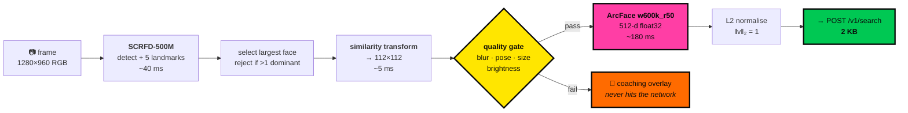

# 04 — Face Recognition Pipeline

Everything between the camera sensor and a 512-dimensional vector, plus the governance that decides
what that vector is allowed to mean.

---

## 1. Pipeline



---

## 2. Models

Both from InsightFace's `buffalo_l` pack, exported to ONNX. Apache-2.0 code; **model weights are
released for non-commercial research use** — acceptable for a hackathon prototype, and a licence
question that must be resolved before any deployment. Flagged in §10.

| Stage | Model | Input | Output | Size | Mobile CPU |
| --- | --- | --- | --- | --- | --- |
| Detection | SCRFD-10G / 500M | 640×640 | boxes + 5 landmarks | 16.9 MB / 2.5 MB | 40 ms / 18 ms |
| Recognition | ArcFace `w600k_r50` | 112×112 | 512-d float32 | 166 MB | ~180 ms |

### `model_id = "insightface/w600k_r50@1"`

**One recognition model, everywhere.** Both apps, and the disabled server endpoint, use the same
weights. This is not a convenience — it is a correctness requirement.

> **The trap:** `buffalo_s` (`w600k_mbf`, 12.9 MB) is tempting for low-end devices. It is a
> different model, so it produces a **different, incomparable embedding space**. Comparing a
> `w600k_r50` vector to a `w600k_mbf` vector yields a number that looks like a similarity score and
> means nothing. The system would not crash. It would confidently return wrong people.
>
> If a smaller model is ever needed, it gets its **own `model_id`, its own rows, and its own partial
> HNSW index** — every enrolled face re-embedded under it. Never a substitution.

### App bundle strategy

166 MB inside an APK is unacceptable. Models are **downloaded on first launch** and cached:

```
1. App installs at ~28 MB
2. First launch → "PREPARING RECOGNITION ENGINE" (neobrutalist progress, on-brand)
3. Fetch from a versioned CDN path (R2 public bucket, or the GitHub Release asset)
4. Verify SHA-256 against a hash compiled into the binary  ← integrity gate
5. Cache to app-private storage; ONNX session created once and held
6. Offline from then on
```

Step 4 is the one that matters. A model file swapped in transit is a supply-chain attack against
the recognition system itself. The expected digest ships inside the signed APK.

---

## 3. Alignment

The step most often skipped, and the one that most affects accuracy. ArcFace is trained on faces
aligned to a canonical 5-point template; feeding it an unaligned crop costs far more accuracy than
any threshold tuning recovers.

```
Canonical destination (112×112, ArcFace standard):
    left eye     (38.29, 51.69)
    right eye    (73.53, 51.50)
    nose tip     (56.02, 71.74)
    left mouth   (41.55, 92.37)
    right mouth  (70.72, 92.20)

Estimate a similarity transform (scale + rotation + translation, no shear)
from SCRFD's 5 detected landmarks onto that template, then warp bilinearly.
```

Then: BGR→RGB, `(pixel - 127.5) / 127.5` → `[-1, 1]`, `NCHW` float32.

**Pose is derived from the same landmarks** and feeds the quality gate — no separate model needed:

```
yaw   ≈ atan2(nose.x - eye_midpoint.x, interocular_distance)
pitch ≈ atan2(nose.y - eye_midpoint.y, interocular_distance)
roll  = the rotation the transform already removed
```

---

## 4. Quality gate

Runs **on-device, before the network**. A low-quality probe does not produce a low-confidence
answer — it produces a *confidently wrong* one, because a blurred face collapses toward the mean of
the embedding space and starts scoring plausibly against many people. This gate is the single
highest-value defect-prevention step in the system.

| Metric | Method | Hard floor | Good | Coaching message |
| --- | --- | --- | --- | --- |
| Detector confidence | SCRFD score | 0.60 | > 0.85 | "NO FACE DETECTED" |
| Face size | aligned source px | 112 | > 200 | "MOVE CLOSER" |
| Blur | variance of Laplacian | 60 | > 120 | "HOLD STEADY" |
| Yaw | landmark geometry | ±35° | ±15° | "FACE THE CAMERA" |
| Pitch | landmark geometry | ±25° | ±12° | "LEVEL THE CAMERA" |
| Brightness | mean luma | 40–215 | 80–180 | "TOO DARK" / "MOVE TO SHADE" |
| Faces in frame | SCRFD count | — | 1 | "MULTIPLE FACES — ISOLATE SUBJECT" |

```
quality.score = 0.30·norm(det) + 0.25·norm(size) + 0.20·norm(blur)
              + 0.15·norm(pose) + 0.10·norm(brightness)
```

`QUALITY_FLOOR = 0.35` (server-enforced too, from `/v1/config`). Below it the client refuses to
search and the server rejects it if the client is patched around.

**Override:** an officer may force a search on a rejected capture. It proceeds with
`quality_override = true` written into the audit record, and the results screen carries a permanent
red band — `LOW-QUALITY PROBE · RESULTS UNRELIABLE`. Blocking outright would get the app abandoned
in a genuinely urgent situation; making the override loud and permanent is the right trade.

---

## 5. Scoring and bands

Embeddings are L2-normalised, so cosine similarity is the correct metric — ArcFace optimises angular
margin on a hypersphere, and Euclidean distance on normalised vectors is a monotonic function of it
anyway.

```
similarity = 1 - (a <=> b)        -- pgvector cosine distance operator
```

| Band | Range | Colour | Label shown | Meaning |
| --- | --- | --- | --- | --- |
| `NO_MATCH` | < 0.28 | — | *not displayed at all* | Noise |
| `WEAK` | 0.28 – 0.42 | amber `#FF6B00` | INSUFFICIENT | Do not act |
| `REVIEW` | 0.42 – 0.58 | cyan `#00C2CB` | REQUIRES VERIFICATION | Compare carefully |
| `STRONG` | ≥ 0.58 | magenta `#FF3EA5` | STRONG CANDIDATE | Still requires confirmation |

**These are deliberately stricter than the ~0.4 commonly cited for ArcFace.** That figure comes from
1:1 verification benchmarks. This is 1:N identification against a database, where false-match
probability grows with N — and where a false match is a wrongful detention rather than a failed
login. Asymmetric costs demand asymmetric thresholds.

### Language rules, enforced in code

The word **MATCH** never appears as a system assertion. Not in the API, not in the UI, not in a
notification. Only ever `CANDIDATE`. Automation bias is driven by the language a system uses about
its own confidence; "STRONG CANDIDATE" and "MATCH FOUND" produce measurably different officer
behaviour on identical data.

### The score gap

```
score_gap = similarity[0] - similarity[1]
ambiguous = score_gap < 0.05
```

Two candidates within 0.05 is the classic misidentification setup — often siblings, or simply two
people the model cannot separate. When `ambiguous`, both are highlighted, the banner reads
`AMBIGUOUS — TWO SIMILAR CANDIDATES`, and confirmation requires a second deliberate tap.

### Always at least three

Even when rank 1 scores 0.91. A single result invites a yes/no reflex; three faces force a
comparison. It is the cheapest available countermeasure to automation bias and it costs one integer
in a `LIMIT` clause.

---

## 6. Device compatibility

This was the stated condition on choosing the on-device path, so it is answered concretely rather
than assumed.

### Runtime

`onnxruntime-react-native`, wrapped in `packages/face`. New Architecture compatible, requires a
custom dev client (not Expo Go — noted in [05](05-MOBILE-APPS.md) §2).

| Platform | Execution providers | Notes |
| --- | --- | --- |
| Android | NNAPI → XNNPACK → CPU | NNAPI availability varies by OEM; XNNPACK is the reliable floor |
| iOS | CoreML → XNNPACK → CPU | CoreML solid on A12+ |

**Provider selection is a runtime probe, not a build-time assumption.** The app tries NNAPI/CoreML,
times a warm-up inference, and falls back to XNNPACK if the accelerated path is slower or errors —
which it sometimes is on budget Android SoCs, where NNAPI drivers are frequently worse than a tuned
CPU kernel.

### Expected performance

| Tier | Example | Embed time | Verdict |
| --- | --- | --- | --- |
| Flagship (2023+) | SD 8 Gen 2, A16 | 60–90 ms | Excellent |
| Mid (2022+) | SD 778G, Dimensity 900 | 150–220 ms | **Target device** |
| Budget (2021+) | SD 680, Helio G85 | 300–450 ms | Acceptable, degraded |
| Entry / < 4 GB RAM | SD 4-series, Go edition | 600 ms+ or OOM | **Not supported** |

### Degradation ladder

Applied automatically from a timed warm-up on first launch:

```
1. Full: SCRFD-10G @640 + ArcFace r50            → flagship / mid
2. Reduce detector input 640 → 320               → saves ~25 ms, minor small-face recall loss
3. Swap detector to SCRFD-500M                   → saves ~22 ms; recognition model UNCHANGED
4. Single-shot capture instead of live preview   → removes per-frame detection entirely
5. Device unsupported → explicit block screen with the device fingerprint
```

**Only the detector is ever downgraded.** The recognition model is fixed, because changing it
changes the embedding space (§2). Steps 1–4 all produce vectors that are directly comparable to
every other vector in the database.

Step 5 blocks rather than degrading silently. An app that quietly produces worse identifications on
a cheap handset is a system that misidentifies poorer people more often, and that is not a bug we
are willing to ship as a preference.

### Verification before commitment

`packages/face` ships a **self-test**, runnable on any device, before the rest of the app is built:

```
· load models, assert SHA-256
· embed 20 bundled synthetic pairs (10 same-identity, 10 different)
· assert same-identity cosine > 0.55, cross-identity < 0.30
· report p50/p95 embed latency and the chosen execution provider
```

This is the go/no-go gate for the on-device decision. If the self-test fails on the target device
fleet, the fallback is `ENABLE_SERVER_EMBED=true` on a larger host — the API contract already
supports it and nothing else in the system changes. Run this on day 1 of the build, not day 4.

---

## 7. Accuracy, bias and honest limits

The section that makes the difference between a hackathon demo and something a government could
responsibly evaluate.

### What we publish

| Metric | Definition | Reported |
| --- | --- | --- |
| FMR | False match rate at each band boundary | Per band, on a held-out synthetic set |
| FNMR | False non-match rate | Same |
| Rank-1 accuracy | Correct identity at rank 1 | Overall |
| Rank-5 recall | Correct identity anywhere in the top 5 | The operationally relevant one |
| Per-cohort differential | FMR/FNMR split by age band, gender, skin tone | **Published, not buried** |

### The bias problem, stated plainly

NIST's FRVT programme has repeatedly measured **differential error rates across demographic groups**
in essentially every algorithm tested. Publicly available models are trained on corpora skewed
Western and East-Asian. For deployment in India this is a live operational risk, not a footnote —
higher false-match rates for some groups mean a system that stops some people more often for the
same underlying behaviour.

We cannot fix this at the model layer with the resources available. What we do instead:

1. **A human decides, always.** The structural mitigation, and the reason it is enforced in the
   schema rather than the UI.
2. **Publish per-cohort metrics.** A number that is measured and disclosed can be argued with. A
   number that is hidden becomes policy by default.
3. **Higher thresholds than the literature suggests.** Trading false negatives for false positives,
   deliberately, because the costs are asymmetric.
4. **Quality-scaled caution.** Low-quality probes carry a persistent unreliability banner.
5. **`latency_ms` on every decision.** Officers rubber-stamping in under a second is detectable, and
   detectable means addressable.
6. **A stated evaluation protocol** for any real deployment: measure on a representative local
   cohort *before* going live, not after.

### Explicitly not solved here

| Gap | Consequence | Where it goes |
| --- | --- | --- |
| **No liveness detection** | A printed photo defeats the system | First post-hackathon addition, [12](12-SCALING-ROADMAP.md) §6 |
| No twin/sibling handling | Close relatives score highly | Partly covered by the ambiguity flag |
| Ageing | Embeddings drift over years | Re-enrolment policy; multi-epoch embeddings per person |
| Occlusion (mask, helmet) | Degraded accuracy | Quality gate rejects; no covert workaround |
| Model licence | Non-commercial research weights | **Must be resolved before deployment** |
| No adversarial-input defence | Crafted vectors could probe the DB | Norm + dimension validation only; a real gap |

That last row is a genuine hole worth naming: because the API accepts vectors rather than images, a
compromised device could submit synthesised embeddings to explore the database. Norm and dimension
checks stop the trivial cases. Proper defence needs device attestation, and that needs the
authentication we deliberately do not have. It is the clearest cost of the no-auth decision, and it
is written down in [ADR-0003](ADR/0003-no-auth-defensible.md) rather than glossed over.

---

## 8. Enrolment differences

Perigee Enroll uses the same pipeline with a stricter posture:

| | Field (search) | Enroll (registration) |
| --- | --- | --- |
| Quality floor | 0.35 | **0.60** — a bad enrolment poisons every future search |
| Captures required | 1 | **3+** — frontal, left, right |
| Embeddings stored | none | one row per capture, all under the same `model_id` |
| Source image | never persisted | stored in R2, EXIF stripped |
| Override permitted | yes, flagged | **no** |

**Multiple embeddings per person is a meaningful accuracy win.** Search returns the best-scoring row
per person (`DISTINCT ON (person_id)`), so pose variance in the probe is absorbed by having covered
that variance at enrolment. Storage cost: 2 KB per extra angle.

---

## 9. Threshold governance

Thresholds are **configuration, versioned and audited** — never constants in the client.

```
1. Bands live server-side, served by GET /v1/config
2. Every search freezes threshold_in_effect + band_config into search_event
3. A change writes an audit_event: 'config.threshold_changed' with old and new
4. The client renders what it was given; a band boundary never appears in app source
```

Consequence: a decision from any point in the past can be re-evaluated against the policy that was
actually in force when it was made. Without this, threshold tuning silently rewrites the meaning of
every historical record — and tuning *will* happen, probably the night before the demo.

---

**Next:** [05 — Mobile Applications](05-MOBILE-APPS.md)
