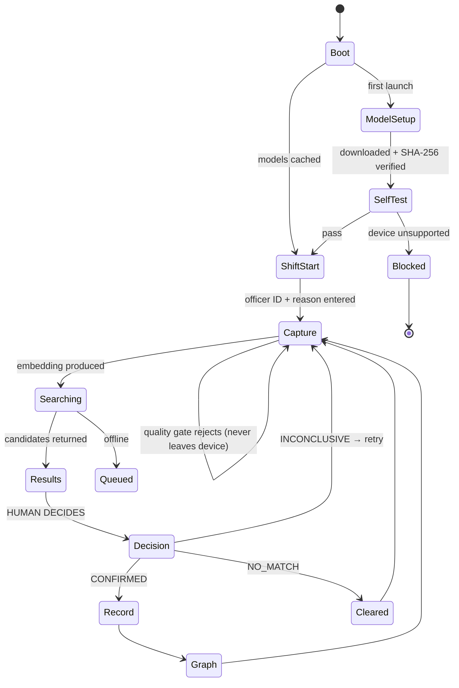

# 05 — Mobile Applications

Two apps, one Expo monorepo. **Perigee Field** (officers) and **Perigee Enroll** (records desk).

---

## 1. Monorepo

```
perigee-mobile/
├── apps/
│   ├── field/                    # com.perigee.field
│   │   ├── app/                  # expo-router file routes
│   │   ├── app.json
│   │   └── eas.json
│   └── enroll/                   # com.perigee.enroll
├── packages/
│   ├── face/                     # ONNX pipeline — the load-bearing package
│   ├── ui/                       # neobrutalist components
│   ├── design-tokens/            # shared with the web app
│   └── api-client/               # generated from OpenAPI + offline queue
├── pnpm-workspace.yaml
└── package.json
```

`pnpm` workspaces, `expo-router` for file-based navigation in both apps. Two bundle IDs, two EAS
profiles, one dependency tree and one place to fix a bug.

---

## 2. Runtime constraints

| Item | Value | Consequence |
| --- | --- | --- |
| Expo SDK | 54+ | RN 0.81+, New Architecture, `boxShadow` support |
| Architecture | New (Fabric + TurboModules) | Required by `onnxruntime-react-native`; SDK 54 is the last with Old Arch |
| **Expo Go** | **Not usable** | ONNX is a native module — a **custom dev client** is mandatory |
| Minimum Android | API 26 (8.0) | NNAPI availability |
| Minimum iOS | 15.1 | CoreML EP |
| Minimum RAM | 4 GB | Below this the ONNX session OOMs — blocked, not degraded |

> **Build a custom dev client on day 1.** `npx expo run:android` or an EAS `development` profile
> build. Discovering on day 3 that Expo Go cannot load ONNX is a well-known way to lose a hackathon.

### Dependencies

```jsonc
{
  "expo": "~54.0.0",
  "expo-router": "~4.0.0",
  "expo-camera": "~16.0.0",
  "expo-file-system": "~18.0.0",       // model download + cache
  "expo-secure-store": "~14.0.0",      // device key, officer session
  "expo-image": "~2.0.0",              // mugshot rendering, memory-efficient
  "onnxruntime-react-native": "^1.20.0",
  "react-native-reanimated": "~4.0.0",
  "react-native-gesture-handler": "~2.20.0",
  "@shopify/react-native-skia": "^1.5.0",
  "moti": "^0.29.0",
  "nativewind": "^4.1.0",
  "@tanstack/react-query": "^5.60.0",
  "zustand": "^5.0.0",
  "@react-native-community/netinfo": "^11.4.0"
}
```

**State: Zustand + React Query, no Redux.** React Query owns everything server-derived (candidates,
person records, config) with its cache and retry logic. Zustand owns the little that is genuinely
local: officer session, camera state, offline queue, device capability profile. Redux here would be
ceremony for perhaps 200 lines of state.

---

## 3. Perigee Field

### Navigation

```
app/
├── _layout.tsx              # providers, watermark, model bootstrap
├── index.tsx                # SHIFT START — officer ID + reason code
├── capture.tsx              # camera + live quality HUD
├── results/[searchId].tsx   # candidates + decision  ← the app
├── person/[id].tsx          # full record (purpose-bound)
├── graph/[id].tsx           # orbit view
├── pending.tsx              # unadjudicated searches
└── settings.tsx             # night mode, diagnostics, self-test
```

### The flow



### Screens

**`index` — Shift Start.** Officer ID and reason code, entered once, held in `expo-secure-store` for
the shift (8 h expiry). Not a login — no password, nothing verified. The screen says so plainly:
*"This identifier is recorded with every search. It is not verified."* Overstating what this is
would be the dishonest choice.

**`capture` — the camera.** Live preview with a quality HUD: a `<QualityMeter>` reading blur, pose
and size at ~10 fps from lightweight detection, plus a coaching line (`HOLD STEADY`, `MOVE CLOSER`).
The 64 dp `signal`-yellow capture button is disabled until quality clears the floor — the *button
itself* is the gate. A long-press forces an override, with the consequences shown before it fires.

On capture: freeze the frame, run the Skia scan sweep, embed, POST.

**`results/[searchId]` — the whole product.** Specified in [07 §10](07-DESIGN-SYSTEM.md#10--reference--the-field-results-screen).
Rules it enforces:

- Candidates arrive staggered, 60 ms apart — ~240 ms of enforced looking
- Minimum three, masked names only
- `NO MATCH` is visually equal to `CONFIRM`, never a secondary link
- `ambiguous` → both cards shake, confirmation needs a second tap
- **No back gesture.** Leaving requires a decision, or an explicit `ABORTED` — which is itself
  recorded. The blocking modal on back-press says: *"A decision is required. This search is
  logged."*
- Time-on-screen is measured and sent as `latency_ms`

**`person/[id]` — the record.** Only reachable after `CONFIRMED`. Full name, aliases, mugshots,
cases. `convicted` and `accused` render in visually distinct blocks and are never summed. A
`GRAPH →` action opens the network.

**`graph/[id]` — orbit view.** Skia, per [07 §8](07-DESIGN-SYSTEM.md#8--the-orbit-graph). Tap a node
to re-centre; tap an edge to see the FIRs that justify it.

**`pending` — the brake made visible.** Reached on `429 PENDING_DECISION_LIMIT`. Lists open searches
with their age. Cannot be dismissed without adjudicating. This screen is the human-in-the-loop
policy given a surface.

### Offline

```
capture → embed → POST /v1/search
                       ↓ network unavailable
                  queue in SQLite (embedding + metadata, ~2 KB)
                       ↓ connectivity restored
                  drain FIFO, decisions still required for each
```

Embeddings queue; **decisions never do**. A queued search that resolves later still demands human
adjudication before it closes. Queue depth is capped at 20 — beyond that the app refuses new
captures, because a 50-deep backlog is not something a human meaningfully reviews.

---

## 4. Perigee Enroll

The records-desk app. Same packages, different posture: deliberate rather than fast.

```
app/
├── index.tsx                 # roster + search by name
├── person/new.tsx            # identity fields
├── person/[id]/capture.tsx   # guided multi-angle capture
├── person/[id]/cases.tsx     # FIR linking, IPC/BNS dual entry
├── person/[id]/links.tsx     # manual edge creation
└── review.tsx                # pre-commit summary
```

### Guided multi-angle capture

Three captures minimum — frontal, left ~25°, right ~25° — each gated at **quality ≥ 0.60**, with no
override. The UI walks the operator through with a live pose indicator:

```
┌────────────────────────────┐
│  CAPTURE 2 OF 3            │
│  ┌──────────────────────┐  │
│  │      [ preview ]     │  │
│  │   ← TURN LEFT 25°    │  │   live yaw readout, Martian Mono
│  └──────────────────────┘  │
│  YAW  -18.4°  ▓▓▓▓▓░░░░░   │   turns `clear` green in range
│  ✓ FRONTAL   ● LEFT   ○ RIGHT │
└────────────────────────────┘
```

Each capture produces one `face_embedding` row under the same `model_id`, plus one `media` object in
R2. **This is where accuracy is actually won.** Pose variance covered at enrolment is pose variance
the field probe does not have to match. Three angles instead of one costs 4 KB and measurably lifts
rank-1 accuracy.

Enrolment is transactional: person, media and embeddings commit together or not at all. A person
with an identity row but no vectors is invisible to search — a silent, hard-to-notice failure.

### Edge creation

Manual linking (`co_accused`, `shared_address`, `family`, …) **requires at least one evidence case
ID**. The save button is disabled without it. An unevidenced edge is an unfalsifiable accusation,
and the UI refuses to create one.

---

## 5. `packages/face`

The package everything depends on.

```ts
export interface FaceEngine {
  init(): Promise<InitResult>;              // download, verify SHA-256, create session
  detect(frame: ImageData): Promise<Detection[]>;
  embed(frame: ImageData, det: Detection): Promise<EmbedResult>;
  assessQuality(frame: ImageData, det: Detection): QualityReport;
  selfTest(): Promise<SelfTestReport>;      // the go/no-go gate
  readonly modelId: string;                 // 'insightface/w600k_r50@1'
  readonly provider: 'nnapi' | 'coreml' | 'xnnpack' | 'cpu';
}

export interface EmbedResult {
  embedding: Float32Array;   // 512, L2-normalised
  modelId: string;
  quality: QualityReport;
  latencyMs: number;
}
```

Design notes:

- **One ONNX session, created once, held for the app lifetime.** Session creation costs ~800 ms;
  doing it per capture makes the app feel broken.
- **`modelId` is emitted by the engine, never typed by a caller.** The one place it is defined.
- **Normalisation happens here**, so no call site can forget it and silently corrupt cosine ranking.
- **`selfTest()` ships in production**, reachable from Settings → Diagnostics. When something is
  wrong on a specific device, this is what tells you.

---

## 6. Distribution

### Android — the real path

```bash
eas build --profile production --platform android
# → .apk (not .aab; GitHub Releases needs a directly installable artifact)
```

`eas.json`:

```jsonc
{
  "build": {
    "development": { "developmentClient": true, "distribution": "internal" },
    "preview":     { "distribution": "internal", "android": { "buildType": "apk" } },
    "production":  { "android": { "buildType": "apk" },
                     "env": { "EXPO_PUBLIC_API_URL": "https://perigee-core.onrender.com" } }
  }
}
```

APKs attach to a GitHub Release; the website links to `/releases/latest`. **Publish the SHA-256 of
each APK in the release notes** — a sideloaded police app with no integrity story is a bad look, and
the fix is one line.

Free tier: 30 builds/month, ≤15 iOS. Budget for roughly 10 across the hackathon and do not burn them
on config typos — test with local `run:android` first.

### iOS — the honest position

**iOS cannot be publicly distributed without a $99/yr Apple Developer account.** No sideloading, no
GitHub Release install. Options:

| Path | Cost | Reach |
| --- | --- | --- |
| Local dev client on a tethered device | ₹0 | The demo device only |
| TestFlight | $99/yr | 10,000 testers |
| App Store | $99/yr + review | Public — and review for a police FR app is not a given |

**Plan: Android for distribution, iOS for the demo device if there is a Mac available.** The website
says exactly this rather than showing a greyed-out iOS button, because judges notice the difference
between a limitation you named and one they found.

### OTA updates

`expo-updates` on the free tier (1,000 MAU) covers JS-only fixes without an EAS build — invaluable
the night before a demo. Native changes (ONNX, Skia) still need a full build. Copy changes,
threshold display, layout fixes: OTA.

---

## 7. Performance

| Concern | Mitigation |
| --- | --- |
| ONNX session init ~800 ms | Once at app start, behind the splash |
| Model download 183 MB | First launch only, resumable, cached; on Wi-Fi if detected |
| Camera preview + detection | Throttle detection to 10 fps; preview stays 30 fps |
| Mugshot memory | `expo-image` with `recyclingKey`, capped memory cache |
| Skia orbit graph | ≤60 nodes; `truncated` flag surfaced when the server capped it |
| Reanimated on the UI thread | No `runOnJS` in gesture handlers |
| Render cold start | Pre-warm `/healthz` at app launch; "SYSTEM WAKING" state, not a spinner |
| Battery | No background processing. Camera released the moment capture completes. |

---

## 8. Testing

| Layer | Tool | Covers |
| --- | --- | --- |
| Face pipeline | Jest + fixtures | Alignment maths, quality scoring, normalisation |
| **Self-test on-device** | built in | Same/cross-identity separation, latency, provider |
| Components | React Native Testing Library | Bands render correctly; `NO MATCH` is never de-emphasised |
| API client | MSW | Retry, offline queue, every error code |
| Flow | Maestro | Capture → results → decision, including the no-back-without-decision rule |

**One non-negotiable test:** the results screen cannot be exited without a recorded decision. It is
the load-bearing safety property of the whole product, and it lives one careless navigation refactor
away from being broken.

---

**Next:** [06 — Web Frontend](06-WEB-FRONTEND.md)
