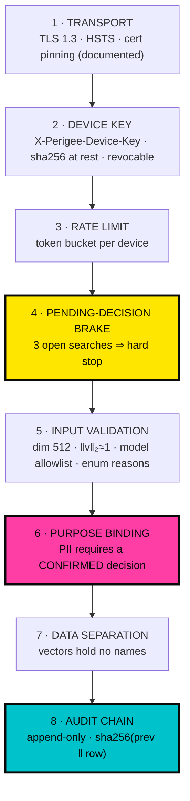

# 08 — Security & Governance

The requirement was: **no authentication, yet secure enough that nobody questions it.** Those are in
tension, and the resolution is not to pretend otherwise. It is to be precise about which security
properties survive without login, which do not, and what compensates.

Decision record: [ADR-0003](ADR/0003-no-auth-defensible.md).

---

## 1. What "no auth" costs, stated first

Anyone evaluating this seriously will ask. Answering before they do is worth more than any control
listed later.

| Property | With auth | Here | Compensation |
| --- | --- | --- | --- |
| **Identity of the searcher** | Proven | **Asserted only** | Recorded immutably; displayed on screen; anomaly-detectable |
| **Non-repudiation** | Strong | **Weak** | Device key binds to a physical handset; hash chain binds to a timeline |
| **Per-officer revocation** | Yes | **No** | Per-*device* revocation, immediate |
| **Jurisdiction scoping** | Enforced | **Absent** | Single-jurisdiction prototype; the clamp is specified, not built |
| **Adversarial-input defence** | Attestation possible | **Absent** | Vector shape + norm validation only — a real, named gap |

**These are not solved. They are deferred, and the deferral is deliberate**: every one of them costs
demo friction, and the prototype's job is to prove the interaction model. The upgrade path is in §8
and it is not speculative — it is the standard OIDC-plus-mTLS build.

The honest one-line summary: *this system knows which device searched and when, and it can prove
nobody edited that record afterwards. It cannot prove which human held the device.*

---

## 2. Attribution ≠ authentication

Every search carries `officer_id` and `reason_code`. The client asserts both; nothing verifies them.

What that still buys:

1. **Every search is permanently attributable** to a claimed identity, in an append-only chain.
2. **The claim is displayed back**, persistently: `SEARCHING AS OFFICER-1147 · ROUTINE CHECK`. Social
   accountability is weaker than cryptographic accountability and considerably stronger than
   nothing.
3. **Purpose is recorded per search.** `reason_code` is a closed enum. An officer selecting
   `routine_check` forty times in an hour is a visible pattern.
4. **Anomalies are computable.** Decision latency under 1 s, `browse` reason spikes, one device
   claiming a dozen officer IDs in a shift — all detectable from `search_event` alone.

The UI never calls this a login, and the Shift Start screen says in plain text: *"This identifier is
recorded with every search. It is not verified."* Calling an unverified string a login is how a
prototype teaches people a false expectation.

---

## 3. Defence layers



Layers 4, 6 and 8 are the ones that are genuinely unusual, and they are the ones to talk about.

### Layer 2 — device key

A 32-byte random value, generated per build, injected via EAS secrets, stored in `expo-secure-store`
(Keychain / Android Keystore). The server stores only `sha256(key)`.

**What it is:** a coarse gate that keeps the API off the open internet and makes revocation possible
per handset.
**What it is not:** proof of anything about the person holding the device. A rooted phone yields the
key. That is acknowledged, not papered over — it is why the layer sits *below* rate limiting and
purpose-binding rather than above them.

### Layer 4 — the pending-decision brake

The most interesting control in the system, because it enforces a *policy* rather than a *boundary*.

```
open PENDING_DECISION searches for this device ≥ 3  →  429, hard stop
```

Enforced by a database trigger ([02 §7](02-DATA-MODEL.md#7--human-in-the-loop-enforced-by-the-database)),
not application logic, so it survives a refactor. Consequences:

- Bulk querying is structurally impossible — no queue of unreviewed results can accumulate
- Every search maps 1:1 to a human judgement
- Abandonment is recorded as `EXPIRED`, which is itself a reviewable signal

This is what turns "there's a human in the loop" from a claim into a property.

### Layer 6 — purpose binding

`GET /v1/person/{id}` requires a `search_id` whose decision is `CONFIRMED` **and** whose
`confirmed_person_id` matches. Without it: `403 PURPOSE_NOT_AUTHORISED`.

The app therefore cannot be used as a general-purpose PII browser. Identification is the only door
into a record, and walking through it leaves a mark.

The `browse` reason code is the deliberate escape hatch — legitimate investigative browsing exists,
and a control with no valve gets circumvented rather than obeyed. It works, and it is logged under a
distinct audit action that stands out in any review.

### Layer 7 — data separation

`face_embedding` holds `person_id`, a vector, `model_id`, quality. No name. No case. No address.
An attacker with that table alone has floats and opaque UUIDs.

This is not theoretical: biometric templates are the highest-value data in the system, because
unlike a password a face cannot be rotated. Keeping them in a table that cannot self-identify is the
cheapest meaningful mitigation available.

### Layer 8 — audit chain

`sha256(prev_hash ‖ canonical_json(row))`, append-only triggers, `/v1/audit/verify`.

**Tamper-evident, not tamper-proof.** A superuser can drop the triggers and rewrite rows — but not
without breaking the chain from that point forward, which verification surfaces immediately. Genuine
tamper-proofing needs an external append-only sink (S3 Object Lock) or a public anchor for a daily
root hash. Both are specified in [12 §5](12-SCALING-ROADMAP.md) and neither is built. Claiming more
than this delivers would be the kind of overstatement that destroys credibility in the room.

---

## 4. Threat model

Assets, ranked by what their loss actually costs:

| # | Asset | Impact if compromised |
| --- | --- | --- |
| A1 | Face embeddings | **Critical** — biometrics are unrevocable |
| A2 | Person PII + criminal records | **Critical** — reputational and physical harm |
| A3 | Search history (who was stopped, where) | **High** — a surveillance dataset in its own right |
| A4 | Audit chain integrity | **High** — the accountability story collapses |
| A5 | Device keys | Medium — API access, revocable |
| A6 | Availability | Low for a prototype |

### STRIDE

| Threat | Vector | Control | Residual |
| --- | --- | --- | --- |
| **Spoofing** | Stolen device key | Per-device revocation; rate limits; anomaly review | **High** — the cost of no auth |
| | Fabricated `officer_id` | Recorded; anomaly-detectable | **High** — accepted, named |
| **Tampering** | Rewriting audit history | Hash chain + append-only triggers | Low — detectable |
| | Modifying a decision | Write-once; `409` on retry | Low |
| | Swapping the ONNX model in transit | SHA-256 pinned in the signed APK | Low |
| **Repudiation** | "I never ran that search" | Chain + device binding + timestamp | **Medium** — device, not person |
| **Info disclosure** | Vector table exfiltration | No PII in the table; separate scope | Medium |
| | PII browsing via the app | Purpose binding; `CONFIRMED` required | Low |
| | Candidate list leaks innocent identities | `masked_name` only pre-confirmation | Low |
| | Mugshots via URL sharing | Presigned, 120 s, private bucket | Low |
| **DoS** | Flooding search | Token bucket; Vercel edge limits on public routes | Medium — free tier is inherently fragile |
| **Elevation** | Reaching PII without identifying | Purpose binding at the API, not the UI | Low |

### The two threats worth naming out loud

**T1 — Adversarial embedding submission.** Because the API accepts vectors rather than images, a
compromised device can submit *synthesised* embeddings to probe the database — walking the space to
discover who is enrolled, or crafting a vector that matches many people. Dimension and norm checks
stop the trivial cases and nothing else. Proper defence needs device attestation, which needs
authentication.

*This is the clearest, most direct cost of the no-auth decision, and it is the thing a sharp judge
will find.* Better to have written it down here first.

**T2 — Presentation attack.** No liveness detection. A printed photograph held to the camera
produces a valid, high-quality embedding. Mitigated only by the officer physically looking at the
person in front of them — which, in the roadside use case, is a genuinely meaningful mitigation, but
it is a procedural one, not a technical one. First post-hackathon addition.

---

## 5. Secrets

| Secret | Where | Rotation |
| --- | --- | --- |
| `DATABASE_URL` | Render env, Neon-generated | Neon rotation |
| `R2_ACCESS_KEY_ID` / `SECRET` | Render env only | Manual |
| `DEVICE_KEY_PEPPER` | Render env | Invalidates all device keys |
| `PERIGEE_DEVICE_KEY` (client) | EAS secret → build | Per release |
| `PERIGEE_API_URL` | Vercel env, server-only | — |

**Rules, enforced in CI:**
- `.env` is gitignored; `.env.example` carries names with empty values
- `gitleaks` runs on every push; a hit fails the build
- No `NEXT_PUBLIC_*` variable ever holds a credential
- R2 credentials never reach a client; the server presigns and hands back a URL

---

## 6. Privacy by construction

The strongest privacy properties here are ones the architecture makes *impossible to violate*,
rather than ones a policy forbids:

| Property | How it is guaranteed |
| --- | --- |
| The probe photograph is never stored | It never reaches the server. Not a retention rule — a topology. |
| Innocent candidates are not identified | The API returns `masked_name`; the full name is not in the response |
| Vectors cannot be re-identified alone | Separate table, no PII columns |
| Mugshots are not publicly reachable | Private bucket, presigned 120 s |
| Location is optional | `geo` is nullable and off by default |
| No cross-search linkage of the stopped person | Probe embeddings are not retained by default, so two stops of the same innocent person cannot be linked |

That last row is subtle and matters: if probe embeddings were retained, the system would
inadvertently build a movement history of people who were never charged with anything. Retention is
off by default and capped at 30 days when enabled for audit replay.

**Data minimisation under DPDP §6** is satisfied structurally: the server is not merely instructed
not to collect the photograph — it is not given it.

---

## 7. Operational governance

Controls only matter if someone looks. Specified reviews:

| Signal | Query | Action |
| --- | --- | --- |
| Decision latency < 1 s, repeatedly | `search_decision.latency_ms` | Rubber-stamping — retraining |
| `browse` reason spike | `search_event.reason_code` | Purpose-binding bypass — investigate |
| One device, many officer IDs | `search_event` group by device | Shared handset or spoofing |
| High `EXPIRED` rate | `search_event.status` | Abandoned searches — UX or misuse |
| `quality_override` frequency | `search_decision` | Gate too strict, or being ignored |
| Confirmations below the REVIEW band | join candidates ↔ decisions | Confirming weak evidence — the most serious signal |
| Chain verification failure | `/v1/audit/verify` | Incident |

For the prototype these are SQL queries in `scripts/governance_report.py`. In deployment they belong
in a dashboard owned by someone who is not the operator — oversight one reports to is not oversight.

---

## 8. Upgrade path to production auth

None of this is research. It is the standard build, deferred deliberately.

```
Phase 1 — prototype (now)
    device key · asserted officer_id · purpose binding · audit chain

Phase 2 — pilot
    + OIDC against the state police IdP (Keycloak / departmental SSO)
    + officer_id becomes a verified JWT subject claim
    + RBAC: CONSTABLE / INVESTIGATOR / SUPERVISOR / AUDITOR   ← reuse KAVAL's rbac.py
    + jurisdiction clamp: results scoped to the officer's district

Phase 3 — deployment
    + mTLS client certificates provisioned to department handsets
    + hardware attestation (Play Integrity / DeviceCheck) — closes T1
    + audit chain mirrored to external append-only storage (S3 Object Lock)
    + supervisor co-sign required for any CONFIRMED decision leading to detention
    + liveness detection — closes T2
```

**Phase 2 costs roughly two days** because the seams already exist: `officer_id` is already threaded
through every request and every audit row; making it a verified claim changes where the value comes
from, not what the system does with it. That is the difference between deferring auth and ignoring
it.

---

## 9. The synthetic-data guarantee

`DATASET_MODE=synthetic` is enforced at four layers, because a single flag is a single point of
failure:

1. **Config** — the server refuses to start if unset. No default.
2. **Schema** — `person.dataset_mode` and `case_record.dataset_mode` are `NOT NULL`, written from
   config at insert time.
3. **API** — every response carries `"dataset_mode": "synthetic"`.
4. **UI** — `<SyntheticWatermark>` mounts at the root of both apps whenever the field is present, and
   has no prop to disable it.

Switching to `real` would require a config change, a migration, an API behaviour change and an app
release — plus, legitimately, everything in [09 — Compliance](09-COMPLIANCE-INDIA.md). It is not a
toggle, and it is not meant to be.

---

**Next:** [09 — India Compliance Annex](09-COMPLIANCE-INDIA.md)
