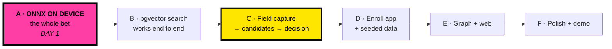

# 13 — Build Plan

Execution order for the hackathon. Written around one principle: **the risky thing goes first.**

---

## 1. The critical path



**Everything depends on A.** If ONNX will not run on the target device at acceptable latency, the
architecture changes — server-side embedding on a larger host — and the API contract already supports
it ([03 §9](03-API-SPEC.md#9--server-side-embedding-specified-disabled)). Learning that on day 1
costs an afternoon. Learning it on day 4 costs the project.

> **Day 1, hour 1: build a custom dev client and run `packages/face` self-test on a real phone.**
> Not the emulator. Not Expo Go — which cannot load native modules and is the classic way to lose a
> day to a confusing error. A real device, and record the p95 latency.

---

## 2. Phases

### Phase 0 — Foundations (½ day, parallelisable)

| Task | Owner | Output |
| --- | --- | --- |
| Three repos, CI skeletons | any | Green pipelines |
| Neon project + extensions + migrations | backend | Schema live |
| R2 bucket + presigning verified | backend | Test upload works |
| Render blueprint + `/healthz` deployed | backend | Public URL |
| Expo monorepo + **custom dev client on a real device** | mobile | App launches |
| `@perigee/design-tokens` published | design | Both consumers import it |

**Exit criterion:** a `/healthz` on Render returning a row from Neon, and a dev client on a physical
phone. Nothing else starts until both are true.

### Phase 1 — De-risk the bet (1 day) ⚠️ **CRITICAL**

| Task | Output |
| --- | --- |
| ONNX models exported, hosted, SHA-256 pinned | Downloadable, verifiable |
| `packages/face`: detect → align → embed → normalise | `Float32Array(512)` |
| Alignment maths unit-tested against fixtures | Correctness, not vibes |
| Quality gate implemented | Blur, pose, size, brightness |
| **`selfTest()` passing on the target device** | **The go/no-go gate** |

**Exit criterion:** on the actual demo phone, two photos of the same synthetic identity score > 0.55
cosine and two different identities score < 0.30, with p95 embed latency recorded.

**If this fails:** flip to `ENABLE_SERVER_EMBED=true` on a Hugging Face Space
([10 §7](10-DEPLOYMENT.md#7--migrating-to-hugging-face-spaces)). Roughly half a day, and nothing
downstream changes. Make this call by end of day 1 — not day 3.

### Phase 2 — The loop (1½ days)

| Task | Output |
| --- | --- |
| `POST /v1/search` + HNSW query + validation | Candidates returned |
| `search_event` / `candidate` / `decision` + the pending trigger | Human-in-loop enforced |
| Audit chain + `/v1/audit/verify` | Chain verifies |
| `packages/ui`: `Brut`, `Button`, `Card`, `ScoreBadge`, `CandidateTile` | Design system live |
| Field: shift start → capture → results → decision | **The demo exists** |
| `seed_synthetic.py` — 500 persons | Something to search |

**Exit criterion:** capture a face on a phone, see ranked candidates, record a decision, and verify
the audit chain reflects it. **This is the demo.** Everything after this is amplification.

### Phase 3 — Enrolment and data (1 day)

Enroll app: identity form, guided 3-angle capture, case linking with IPC/BNS dual entry, edge
creation with mandatory evidence. Plus `compute_edges.py` and `compute_node_metrics.py`.

**Exit criterion:** enrol a person live, then find them with the Field app. That live round-trip is a
strong demo beat — judges see the database is not a fixture.

### Phase 4 — Graph and web (1½ days, parallel)

| Track | Tasks |
| --- | --- |
| **Backend + mobile** | `GET /v1/graph/{id}` recursive CTE; Skia orbit view; edge evidence drill-down |
| **Web** | Landing page, `/explore` force graph, `/download` from GitHub Releases, `/docs` |

Genuinely parallel — different repos, one API contract between them. Agree the contract in Phase 2,
then work independently.

### Phase 5 — Polish and demo prep (1 day)

| Task | Why |
| --- | --- |
| Motion pass — stagger, press, scan sweep, NO MATCH stamp | This is what people remember |
| Night mode | Cyberpunk beat, operationally justified |
| Copy pass — every advisory, every error | The language *is* the governance |
| Watermark verified on every screen | Non-negotiable |
| Production APK builds + SHA-256 in release notes | Distribution |
| Freeze the Neon `demo` branch | Insurance |
| **Full dry run on venue Wi-Fi** | Finds what a laptop demo hides |
| Record a 90-second fallback video | For when the Wi-Fi fails anyway |

---

## 3. Parallelisation

Three tracks after Phase 1. Contracts are agreed once, in Phase 2, and then respected.

```
        Phase 0 ──┬── BACKEND ──── search API ── graph API ── governance queries
                  │
                  ├── MOBILE  ──── packages/face ── Field ── Enroll ── orbit view
                  │                     ▲
                  │                     └── ⚠️ Phase 1 gates everything
                  │
                  └── WEB     ──── design tokens ── landing ── explore ── download
```

**One person owns `packages/face` end to end.** It is the highest-risk, highest-context component,
and splitting it across two people costs more in handover than it saves in throughput.

---

## 4. Cut-lines

Decide these now, while calm. Cut from the bottom when time runs short:

| Priority | Feature | Cut? |
| --- | --- | --- |
| **P0** | Capture → embed → search → candidates → decision | **Never.** This is the product. |
| **P0** | Audit chain + `/verify` | Never — it is the closing demo move |
| **P0** | Synthetic watermark | Never — ethical requirement |
| **P0** | Landing page + APK download | Never — the deliverable |
| P1 | Enroll app | Degrade to seed-script-only if needed |
| P1 | Orbit graph on mobile | Web `/explore` alone can carry the graph story |
| P1 | Night mode | Nice, not load-bearing |
| P2 | Offline queue | Demo has Wi-Fi; document it instead |
| P2 | `/docs` rendering on the site | Link to GitHub |
| P2 | Voice notes, multi-frame probe | Roadmap material |
| **P3** | Anything in [12 §6](12-SCALING-ROADMAP.md) | Already scoped as future work |

**The P0 row is the demo.** If only that exists, the project still presents well — because the pitch
is the *interaction model and the governance*, not feature count.

---

## 5. Known traps

Each of these has cost someone a hackathon.

| Trap | Cost | Avoidance |
| --- | --- | --- |
| **Expo Go cannot load ONNX** | ½ day of baffling errors | Custom dev client, hour 1 |
| **pgvector index not used** | Silent seq scan | `EXPLAIN ANALYZE`; index and query casts must match exactly |
| **Embeddings not L2-normalised** | Meaningless scores, no error | Normalise inside `packages/face`; server validates the norm |
| **Mixing model_ids** | Confident wrong people | `model_id` required, allowlisted, filtered in every query |
| **Render cold start mid-demo** | 50 s of silence | Pre-warm, keepalive, T-15m live search |
| **EAS build queue** | Hours before a deadline | Build the production APK the night before |
| **Recursive CTE without a cycle guard** | Query never returns | `NOT neighbour = ANY(path)` |
| **`SET hnsw.ef_search` at session level** | Random slow queries elsewhere | `SET LOCAL` inside a transaction |
| **Neon connection exhaustion** | Intermittent 503s | Use the `-pooler` connection string |
| **Android `elevation` for shadows** | Soft blur — wrong aesthetic | `boxShadow` on New Arch, or the offset-sibling fallback |
| **Demo dataset edited at 3 a.m.** | Broken demo | Frozen Neon `demo` branch |

---

## 6. Definition of done

Per phase, verifiable. No "it works on my machine."

```
PHASE 1 · packages/face
  ☐ selfTest() passes on the demo device, output recorded in the repo
  ☐ p95 embed latency < 400 ms on the target device
  ☐ same-identity cosine > 0.55, cross-identity < 0.30
  ☐ Model SHA-256 verified on download; a corrupted file is rejected
  ☐ Quality gate rejects a deliberately blurred capture

PHASE 2 · the loop
  ☐ EXPLAIN ANALYZE shows Index Scan on idx_fe_hnsw_*, not Seq Scan
  ☐ A 4th search with 3 pending returns 429 PENDING_DECISION_LIMIT
  ☐ GET /v1/person/{id} without a CONFIRMED decision returns 403
  ☐ /v1/audit/verify returns verified: true after 20 searches
  ☐ An un-normalised embedding returns 422, not a bad result
  ☐ Results screen cannot be exited without a decision  ← Maestro test

PHASE 4 · graph
  ☐ Depth-4 request returns 400, not a slow query
  ☐ A cyclic network terminates
  ☐ Every rendered edge has at least one evidence case ID

PHASE 5 · demo
  ☐ Watermark visible on every screen of both apps
  ☐ Full flow completes on venue Wi-Fi within 8 seconds
  ☐ Fallback video recorded
  ☐ APK SHA-256 published in the release notes
```

---

## 7. The narrative

Build toward this. Five minutes, in this order:

```
0:00  The problem.
      "Suspect someone today, and verifying them takes three hours —
       mostly for people who turn out to be innocent."

0:45  LIVE: capture a face → 3 candidates → NO MATCH → green stamp → person walks.
      "Eight seconds. She goes home."
      ← lead with the release. Every other team leads with a match.

1:45  LIVE: second capture → STRONG CANDIDATE 0.64 → officer confirms → record opens.
      "The system never said 'match'. It ranked candidates. He decided."

2:30  The architecture, in one line.
      "The photograph never left the phone. The server got 512 numbers.
       Which is also why this runs on a free tier."

3:15  The graph. Expand to two hops. Tap an edge → the FIR that proves it.
      "Every link cites a case file. No link without evidence."

4:00  LIVE: /v1/audit/verify over the searches just performed.
      "Hash-chained. Every search, every score, every decision, every threshold in force.
       You just watched it happen; here it is, provably unaltered."

4:40  What we did not build, and why.
      "No liveness detection yet. No crowd scanning — ever. Synthetic data only.
       Here is the compliance checklist we have not ticked."
```

**That last beat is the differentiator.** Every team claims their system works. Almost none volunteer
its limits. In a domain where the obvious objection is civil liberties, having already named your own
gaps is what converts a sceptical judge into a convinced one.

---

**Back to:** [README](../README.md) · [01 — Architecture](01-ARCHITECTURE.md)
