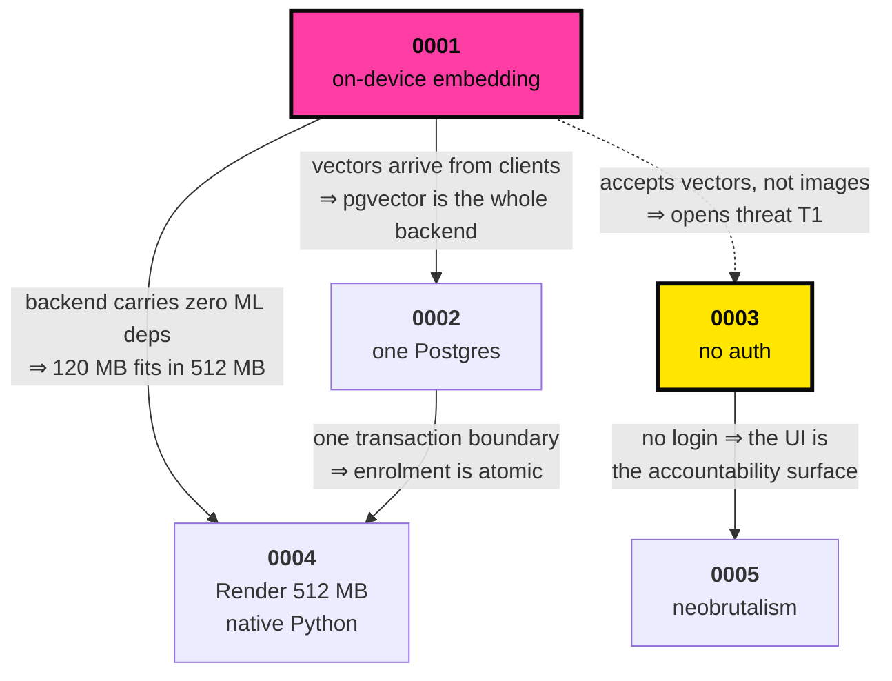

# Architecture Decision Records

Each ADR records one decision: the context that forced it, what was chosen, what that costs, and
what was rejected. They exist so that six months from now — or when a judge asks — the reasoning is
recoverable rather than reconstructed.

Format: Context · Decision · Consequences (good / bad / neutral) · Alternatives considered ·
Revisit when.

| # | Decision | Status | The cost we accepted |
| --- | --- | --- | --- |
| [0001](0001-on-device-embedding.md) | Face embedding runs on-device; the API contract is embedding-first | Accepted | Model drift across devices; adversarial embedding submission |
| [0002](0002-postgres-for-everything.md) | One Postgres for relational, vector and graph | Accepted | Graph traversal capped at 3 hops |
| [0003](0003-no-auth-defensible.md) | No authentication; attribution, purpose-binding and audit instead | Accepted | Identity is asserted, never proven |
| [0004](0004-render-native-python.md) | Render free tier, native Python, no Docker | Accepted | 50-second cold start |
| [0005](0005-neobrutalism-as-ergonomics.md) | Neobrutalism as a field-ergonomics decision | Accepted | Accent contrast needs active policing |

---

## How these interlock

The decisions are not independent — 0001 is what makes 0004 survivable, and 0003 is what 0001 leaves
exposed.

**0001 is the keystone.** Pushing inference to the phone is what makes a free 512 MB backend viable
(0004), reduces the server to a vector index (0002), and produces the privacy claim the whole
project rests on. It is also what opens the one security hole nobody has closed (0003, threat T1) —
because accepting vectors instead of images means accepting vectors nobody can vouch for.

If exactly one decision here is wrong, it is that one, and it is the one verified first
([13 §2, Phase 1](../13-BUILD-PLAN.md#phase-1--de-risk-the-bet-1-day-️-critical)).
